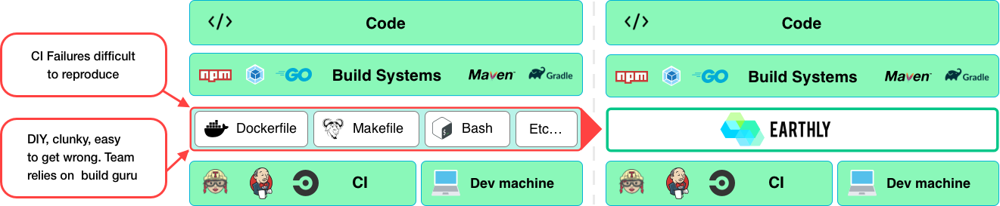
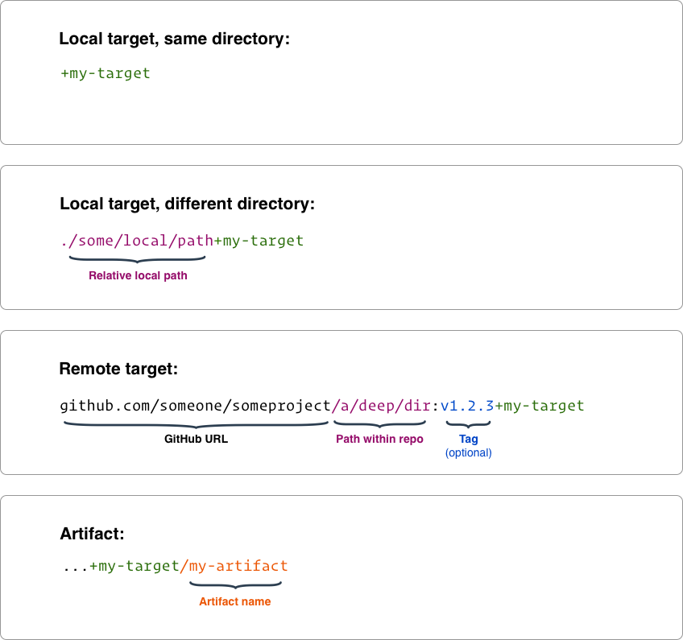

<h1>Earthly</h1>

<div align="center">
  <a href="https://earthly.dev"></a>
  <br/>
  <em>It’s like Docker for builds</em>
</div>
<br/>

[](https://github.com/earthly/earthly/actions?query=workflow%3A%22staging%20release%22+branch%3Amain)
[](https://earthly.dev/slack)
[](https://docs.earthly.dev)
[](https://earthly.dev)
[](https://earthly.dev/get-earthly)
[](https://hub.docker.com/u/earthly)
[](./LICENSE)

[](https://github.com/codespaces/new?hide_repo_select=true&ref=main&repo=246903803)

**🔁 Repeatable Builds** - *Write builds once, and run them anywhere – on your laptop, remote, and in any CI.*

**❤️ Super Simple** - *Instantly recognizable syntax – like Dockerfile and Makefile had a baby.*

**🛠 Compatible with Every Language, Framework, and Build Tool** - *If it runs on Linux, it runs on Earthly.*

**🏘 Great for Monorepos and Polyrepos** - *Organize your build logic however makes the most sense for your project.*

**💨 Fast Builds** - *Build caching and parallel execution makes builds fast automatically.*

**♻️ Reuse, Don't Repeat** - *Never write the same code in multiple builds again.*

---------------------------------

🌎 [Earthly](https://earthly.dev/) is a versatile, approachable CI/CD framework that runs every pipeline inside containers, giving you repeatable builds that you write once and run anywhere. It has a super simple, instantly recognizable syntax that is easy to write and understand – like Dockerfile and Makefile had a baby. And it leverages and augments popular build tools instead of replacing them, so you don’t have to rewrite all your builds no matter what languages you use.

<br/>
<div align="center"><a href="https://earthly.dev/get-earthly"></a></div>

---------------------------------

<h2 align="center">Table of Contents</h2>

* [Why use Earthly?](#why-use-earthly)
* [Where Does Earthly Fit?](#where-does-earthly-fit)
* [How Does It Work?](#how-does-it-work)
* [Installation](#installation)
* [Quick Start](#quick-start)
* [Features](#features)
* [FAQ](#faq)
* [Contributing](#contributing)
* [Licensing](#licensing)


<h2 align="center">Why Use Earthly?</h2>

### 🔁 Repeatable Builds

Earthly runs all builds in containers, making them self-contained, isolated, repeatable, and portable. This allows for faster iteration on build scripts and easier debugging when something goes wrong – no more `git commit -m "try again"`. When you write a build, you know it will execute correctly no matter where it runs – your laptop, a colleague’s laptop, or any CI. You don’t have to configure language-specific tooling, install additional dependencies, or complicate your build scripts to ensure they are compatible with different OSs. Earthly gives you consistent, repeatable builds regardless of where they run.


### ❤️ Super Simple

Earthly’s syntax is easy to write and understand. Most engineers can read an Earthfile instantly, without prior knowledge of Earthly. We combined some of the best ideas from Dockerfiles and Makefiles into one specification – like Dockerfile and Makefile had a baby.


### 🛠 Compatible with Every Language, Framework, and Build Tool

Earthly works with the compilers and build tools you use. If it runs on Linux, it runs on Earthly. And you don’t have to rewrite your existing builds or replace your `package.json`, `go.mod`, `build.gradle`, or `Cargo.toml` files. You can use Earthly as a wrapper around your existing tooling and still get Earthly’s repeatable builds, parallel execution, and build caching.


### 🏘 Great for Monorepos and Polyrepos

Earthly is great for both monorepos and polyrepos. You can split your build logic across multiple Earthfiles, placing some deeper inside the directory structure or even in other repositories. Referencing targets from other Earthfiles is easy regardless of where they are stored. So you can organize your build logic however makes the most sense for your project.


### 💨 Fast Builds

Earthly automatically executes build targets in parallel and makes maximum use of cache. This makes builds fast. Earthly also has powerful shared caching capabilities that speed up builds frequently run across a team or in sandboxed environments, such as Earthly Satellites, GitHub Actions, or your CI.

If your build has multiple steps, Earthly will:
1. Build a directed acyclic graph (DAG).
2. Isolate execution of each step.
3. Run independent steps in parallel.
4. Cache results for future use.


### ♻️ Reuse, Don't Repeat

Never have to write the same code in multiple builds again. With Earthly, you can reuse targets, artifacts, and images across multiple Earthfiles, even ones in other repositories, in a single line. Earthly is cache-aware, based on the individual hashes of each file, and has shared caching capabilities. So you can create a vast and efficient build hierarchy that only executes the minimum required steps.


<h2 align="center">Where Does Earthly Fit?</h2>

<div align="center"></div>

Earthly is meant to be used both on your development machine and in CI. It runs on top of your CI/CD platform (such as [Jenkins](https://docs.earthly.dev/ci-integration/vendor-specific-guides/jenkins), [Circle CI](https://docs.earthly.dev/examples/circle-integration), [GitHub Actions](https://docs.earthly.dev/examples/gh-actions-integration), and [GitLab CI/CD](https://docs.earthly.dev/ci-integration/vendor-specific-guides/gitlab-integration)). Earthly provides the benefits of a modern build automation system wherever it runs – such as caching and parallelism. It is a glue layer between language-specific build tooling (like maven, gradle, npm, pip, go build) and CI, working like a wrapper around your build tooling and build logic that isolates build execution from the environments they run in.


<h2 align="center">How Does It Work?</h2>

In short: **containers**, **layer caching**, and **complex build graphs**!

Earthly executes builds in containers, where execution is isolated. The dependencies of the build are explicitly specified in the build definition, thus making the build self-sufficient.

We use a target-based system to help users break up complex builds into reusable parts. Nothing is shared between targets other than clearly declared dependencies. Nothing shared means no unexpected race conditions. In fact, the build is executed in parallel whenever possible, without any need for the user to take care of any locking or unexpected environment interactions.

> **ℹ️ Note**
> Earthfiles might seem very similar to Dockerfile multi-stage builds. In fact, the [same technology](https://github.com/moby/buildkit) is used underneath. However, a key difference is that Earthly is designed to be a general-purpose build system, not just a Docker image specification. Read more about [how Earthly is different from Dockerfiles](#how-is-earthly-different-from-dockerfiles).


<h2 align="center">Installation</h2>

See [installation instructions](https://earthly.dev/get-earthly).

To build from source, check the [contributing page](./CONTRIBUTING.md).


<h2 align="center">Quick Start</h2>

Here are some resources to get you started with Earthly

* 🏁 [Getting started guide](https://docs.earthly.dev/basics)
* 👀 [Examples](./examples)
  * [Go](./examples/go)
  * [JavaScript](./examples/js)
  * [Python](./examples/python)
  * [Java](./examples/java)
  * [Rust](./examples/rust)
  * [TypeScript (Node)](./examples/typescript-node)
  * [C++](./examples/cpp)
  * [C](./examples/c)
  * [dotnet (C#)](./examples/dotnet)
  * [Ruby](./examples/ruby)
  * [Scala](./examples/scala)
  * [Elixir](./examples/elixir)
  * [COBOL](./examples/cobol)
  * [Monorepo](./examples/monorepo)
  * [Multirepo](./examples/multirepo)
  * [Multiplatform Builds](./examples/multiplatform)
  * [Integration Tests](./examples/integration-test)
* 🔍 Explore [Earthly's own build](https://docs.earthly.dev/docs/examples#earthlys-own-build)
* ✔️ [Best practices](https://docs.earthly.dev/best-practices)

See also the [full documentation](https://docs.earthly.dev).

Reference pages

* 📑 [Earthfile reference](https://docs.earthly.dev/docs/earthfile)
* #️⃣ [Earthly command reference](https://docs.earthly.dev/docs/earthly-command)
* ⚙️ [Configuration reference](https://docs.earthly.dev/docs/earthly-config)

### A simple example (for Go)

```earthly
# Earthfile
VERSION 0.8
FROM golang:1.15-alpine3.13
RUN apk --update --no-cache add git
WORKDIR /go-example

all:
  BUILD +lint
  BUILD +docker

build:
  COPY main.go .
  RUN go build -o build/go-example main.go
  SAVE ARTIFACT build/go-example AS LOCAL build/go-example

lint:
  RUN go get golang.org/x/lint/golint
  COPY main.go .
  RUN golint -set_exit_status ./...

docker:
  COPY +build/go-example .
  ENTRYPOINT ["/go-example/go-example"]
  SAVE IMAGE go-example:latest
```

```go
// main.go
package main

import "fmt"

func main() {
  fmt.Println("hello world")
}
```

Invoke the build using `earthly +all`.

<div align="center"><a href="https://asciinema.org/a/351683?speed=2"></a></div>

Examples for other languages are available in the [examples dir](./examples).


<h2 align="center">Features</h2>

### ⛓ Parallelization that just works

Whenever possible, Earthly automatically executes targets in parallel.

<div align="center"><a href="https://asciinema.org/a/351678?speed=2"></a></div>

### 💾 Caching that works the same as Docker builds

Cut down build times in CI through [shared remote caching](https://docs.earthly.dev/docs/remote-caching).

<div align="center"><a href="https://asciinema.org/a/351674?speed=2"></a></div>

### 🛠 Multi-platform support

Build for multiple platforms in parallel.

```earthly
VERSION 0.8
all:
    BUILD \
        --platform=linux/amd64 \
        --platform=linux/arm64 \
        --platform=linux/arm/v7 \
        --platform=linux/arm/v6 \
        +build

build:
    FROM alpine:3.18
    CMD ["uname", "-m"]
    SAVE IMAGE multiplatform-image
```

### 🤲 Build tools that work everywhere

No need to ask your team to install `protoc`, a specific version of Python, Java 1.6, or the .NET Core ecosystem. Install once in your Earthfile, and it works for everyone. Or even better, you can just make use of the rich Docker Hub ecosystem.

```earthly
VERSION 0.8
FROM golang:1.15-alpine3.13
WORKDIR /proto-example

proto:
  FROM namely/protoc-all:1.29_4
  COPY api.proto /defs
  RUN --entrypoint -- -f api.proto -l go
  SAVE ARTIFACT ./gen/pb-go /pb AS LOCAL pb

build:
  COPY go.mod go.sum .
  RUN go mod download
  COPY +proto/pb pb
  COPY main.go ./
  RUN go build -o build/proto-example main.go
  SAVE ARTIFACT build/proto-example
```

See full [example code](./examples/readme/proto).

### 📦 Modern import system

Earthly can be used to reference and build targets from other directories or even other repositories. For example, if we wanted to build [an example target from the `github.com/earthly/earthly` repository](./examples/go/Earthfile#L17-L20), we could issue

```bash
# Try it yourself! No need to clone.
earthly github.com/earthly/earthly/examples/tutorial/go/part3:main+docker
# Run the resulting image.
docker run --rm earthly/examples:go
```

### 🔨 Reference other targets using +

Use `+` to reference other targets and create complex build inter-dependencies.

<div align="center"><a href="https://docs.earthly.dev/guides/target-ref"></a></div>

Examples

* Same directory (same Earthfile)

  ```earthly
  BUILD +some-target
  FROM +some-target
  COPY +some-target/my-artifact ./
  ```

* Other directories

  ```earthly
  BUILD ./some/local/path+some-target
  FROM ./some/local/path+some-target
  COPY ./some/local/path+some-target/my-artifact ./
  ```

* Other repositories

  ```earthly
  BUILD github.com/someone/someproject:v1.2.3+some-target
  FROM github.com/someone/someproject:v1.2.3+some-target
  COPY github.com/someone/someproject:v1.2.3+some-target/my-artifact ./
  ```

### 🔑 Cloud secrets support built-in

Secrets are never stored within an image's layers and they are only available to the commands that need them.

```bash
earthly set /user/github/token 'shhh...'
```

```earthly
release:
  RUN --push --secret GITHUB_TOKEN=user/github/token github-release upload file.bin
```


<h2 align="center">FAQ</h2>

### How is Earthly different from Dockerfiles?

[Dockerfiles](https://docs.docker.com/engine/reference/builder/) were designed for specifying the make-up of Docker images and that's where Dockerfiles stop. Earthly takes some key principles of Dockerfiles (like layer caching) but expands on the use cases. For example, Earthly can output regular artifacts, run unit and integration tests, and create several Docker images at a time - all outside the scope of Dockerfiles.

It is possible to use Dockerfiles in combination with other technologies (e.g., Makefiles or bash files) to solve such use cases. However, these combinations are difficult to parallelize, challenging to scale across repositories as they lack a robust import system, and often vary in style from one team to another. Earthly does not have these limitations as it was designed as a general-purpose build system.

For example, Earthly introduces a richer target, artifact, and image [referencing system](https://docs.earthly.dev/docs/guides/target-ref), allowing for better reuse in complex builds spanning a single large repository or multiple repositories. Because Dockerfiles are only meant to describe one image at a time, such features are outside the scope of applicability of Dockerfiles.

### How do I know if a command is a classic Dockerfile command or an Earthly command?

Check out the [Earthfile reference doc page](https://docs.earthly.dev/docs/earthfile). It has all the commands there and specifies which commands are the same as Dockerfile commands and which are new.

### Can Earthly build Dockerfiles?

Yes! You can use the command `FROM DOCKERFILE` to inherit the commands in an existing Dockerfile.

```earthly
build:
  FROM DOCKERFILE .
  SAVE IMAGE some-image:latest
```

You may also optionally port your Dockerfiles to Earthly entirely. Translating Dockerfiles to Earthfiles is usually a matter of copy-pasting and making minor adjustments. See the [getting started page](https://docs.earthly.dev/basics) for some Earthfile examples.

### How is Earthly different from Bazel?

[Bazel](https://bazel.build) is a build tool developed by Google to optimize the speed, correctness, and reproducibility of their internal monorepo codebase. The main difference between Bazel and Earthly is that Bazel is a **build system**, whereas Earthly is a **general-purpose CI/CD framework**. For a more in-depth explanation see [our FAQ](https://earthly.dev/faq#bazel).


<h2 align="center">Contributing</h2>

* Please report bugs as [GitHub issues](https://github.com/earthly/earthly/issues).
* Join us on [Slack](https://earthly.dev/slack)!
* Questions via GitHub issues are welcome!
* PRs welcome! But please give a heads-up in a GitHub issue before starting work. If there is no GitHub issue for what you want to do, please create one.
* To build from source, check the [contributing page](./CONTRIBUTING.md).


<h2 align="center">Licensing</h2>

Earthly is licensed under the Mozilla Public License Version 2.0. See [LICENSE](./LICENSE).
