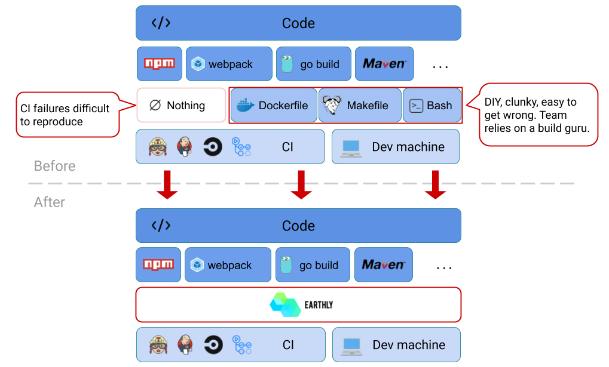

<h1 align="center"><a href="https://earthly.dev"></a></h1>


[](https://goreportcard.com/report/github.com/earthly/earthly)
[](https://gitter.im/earthly-room/community?utm_source=badge&utm_medium=badge&utm_campaign=pr-badge&utm_content=badge)
[](https://docs.earthly.dev)
[](https://earthly.dev)
[](https://hub.docker.com/u/earthly)
[](http://www.apache.org/licenses/LICENSE-2.0)

**🐳 Build anything via containers** - *build images or standalone artifacts (binaries, packages, arbitrary files)*

**🛠 Programming language agnostic** - *allows use of language-specific build tooling*

**🔁 Reproducible builds** - *does not depend on user's local installation. Runs the same locally, as in CI*

**⛓ Parallelism that just works** - *builds in parallel without special considerations the user has to make*

**🏠 Mono-repo friendly** - *ability to split the build definitions across a vast directory hierarchy*

**🏘 Multi-repo friendly** - *ability to import builds or artifacts from other repositories*

---------------------------------

[Earthly](https://earthly.dev) is a build automation tool for the post-container era. It allows you to execute all your builds in containers. This makes them self-contained, reproducible, portable and parallel. You can use Earthly to create Docker images and artifacts (eg binaries, packages, arbitrary files).

<h2 align="center">Why Use Earthly</h2>

### 🔁 Reproduce CI failures

Earthly builds are self-contained, isolated and reproducible. Regardless of whether Earthly runs in your CI or on your laptop, there is a degree of guarantee that the build will run the same way. This allows for faster itteration on the build scripts and easier debugging when something goes wrong. No more `git commit -m "try again"`.

### 🤲 Builds that run the same for everyone

Reproducible builds also means that your build will run the same on your colleagues laptop without any additional project-specific or language-specific setup. This fosters better developer collaboration and mitigates "works-for-me" type of issues.

### 🚀 From zero to working build in minutes

Jump from project to project with ease, regardless of the language they are written in. Running the project's test suites is simply a matter of running an Earthly target (and not fiddling with project configuration to make it compile and run on your system). Contribute across teams with confidence.

### 📦 Reusability

A simple, yet powerful import system allows for reusability of builds across directories or even across repositories. Importing other builds does not have hidden environment-specific implications - it just works.

### ❤️ It's like Makefile and Dockerfile had a baby

Taking some of the best ideas from Makefiles and Dockerfiles, Earthly combines two build specifications into one.

<!--
<h2 align="center">How It Works</h2>

TODO: This section needs to be more scannable.

Containers! Layer caching! And build graphs!

Earthly executes all builds within containers, where execution is isolated. The dependencies of the build are explicitly specified in the build definition, thus making the build self-sufficient.

Earthly uses a target-based system to help users break-up complex builds into reusable parts. Nothing is shared between targets, other than clearly declared dependencies. Nothing shared means no unexpected race conditions. In fact, the build is automatically parallel whenever possible, without any need for the user to take care of any locking or unexpected environment interactions.
-->

<h2 align="center">Where Does Earthly Fit?</h2>

<div align="center"></div>

Earthly is meant to be used both on your development machine and in CI. It can run on top of popular CI systems (like Jenkins, [Circle](https://docs.earthly.dev/examples/circle-integration), [GitHub Actions](https://docs.earthly.dev/examples/gh-actions-integration)). It is typically the layer between language-specific tooling (like maven, gradle, npm, pip, go build) and the CI build spec.

<h2 align="center">Quick Start</h2>

Install Earthly on

* Linux
  ```bash
  sudo /bin/sh -c 'wget https://github.com/earthly/earthly/releases/latest/download/earth-linux-amd64 -O /usr/local/bin/earth && chmod +x /usr/local/bin/earth'
  ```
* Mac
  ```bash
  brew install earthly
  ```
* Windows (**experimental**)
  
  Use the Linux version via WSL

* Your CI

  See the [CI integration guide](https://docs.earthly.dev/guides/ci-integration)

Syntax highlighting available for

* [VS code](https://marketplace.visualstudio.com/items?itemName=earthly.earthfile-syntax-highlighting)
  ```
  ext install earthly.earthfile-syntax-highlighting
  ```

For a full list of installation options see the [Installation page](https://docs.earthly.dev/installation).

### Quick links

To learn how to use Earthly, see

* 🏁 [The getting started guide](https://docs.earthly.dev/guides/basics)
* 📖 The [full documentation](https://docs.earthly.dev)
* 👀 [Examples](https://docs.earthly.dev/examples)
  * [Go](https://docs.earthly.dev/examples/go)
  * [Java](https://docs.earthly.dev/examples/java)
  * [JS](https://docs.earthly.dev/examples/js)
  * [C++](https://docs.earthly.dev/examples/cpp)
  * [Mono-repo](https://docs.earthly.dev/examples/monorepo)
  * [Multi-repo](https://docs.earthly.dev/examples/multirepo)
  * The [examples](./examples) dir
* 🔨 [Earthly's own build](https://docs.earthly.dev/examples/earthly)

Reference pages

* 📑 [Earthfile reference](https://docs.earthly.dev/earthfile)
* #️⃣ [earth command reference](https://docs.earthly.dev/earth-command)
* ⚙️ [Configuration reference](https://docs.earthly.dev/earth-config)

### A simple example (for Go)

```Dockerfile
# Earthfile
FROM golang:1.13-alpine3.11
WORKDIR /go-example

build:
  COPY main.go .
  RUN go build -o build/go-example main.go
  SAVE ARTIFACT build/go-example AS LOCAL build/go-example

docker:
  COPY +build/go-example .
  ENTRYPOINT ["/go-example/go-example"]
  SAVE IMAGE go-example:latest
```

```go
// main.go
package main

import "fmt"

func main() {
	fmt.Println("hello world")
}
```

Invoke the build using either `earth +build` (to build the binary) or `earth +docker` (to build the docker image).

TODO Gif

Examples for other languages are available on the [examples page](https://docs.earthly.dev/examples).

| ℹ️ Note <br/><br/> Earthly might seem very similar to Dockerfile multi-stage builds. In fact, the [same technology](https://github.com/moby/buildkit) is used underneath. However, a key difference is that Earthly is designed to be a general purpose build system, not just a Docker image specification. Read more about [how Earthly is different from Dockerfiles](#how-is-earthly-different-from-dockerfiles). |
| :--- |

<h2 align="center">Features</h2>

### 📦 Modern import system

Earthly has a modern import system, which can be used to reference and build targets from other repositories. For example, if we wanted to build [an example target from the `github.com/earthly/earthly` repository](./examples/go/Earthfile#L17-L20), we could issue

```bash
# Try it yourself! No need to clone.
earth github.com/earthly/earthly/examples/go+docker
# Run the resulting image.
docker run --rm go-example:latest
```

TODO Gif

### 🔨 Reference other targets using +

* Same directory (same Earthfile)
  
  ```Dockerfile
  BUILD +some-target
  FROM +some-target
  COPY +some-target/my-artifact ./
  ```

* Other directories

  ```Dockerfile
  BUILD ./some/deep/dir+some-target
  FROM ./some/deep/dir+some-target
  COPY ./some/deep/dir+some-target/my-artifact ./
  ```

* Other repositories

  ```Dockerfile
  BUILD github.com/someone/someproject+some-target
  FROM github.com/someone/someproject+some-target
  COPY github.com/someone/someproject+some-target/my-artifact ./
  ```

TODO Infographic structure of target refs.

### ⛓ Parallelization that just works

Whenever possible, the system automatically executes targets in parallel.

TODO Gif

### 💾 Caching that works the same as docker builds

TODO Gif

*The build picks up from the point it notices a difference in the code*

### 🛠 Reusability with build args

TODO Redo this example to make it more relevant and immediately applicable.

```Dockerfile
lint:
  FROM golang:1.13-alpine3.11
  RUN go get golang.org/x/lint/golint
  ARG COPY_SRC
  COPY "$COPY_SRC" ./
  RUN golint -set_exit_status .

lint-project-a:
  BUILD --build-arg COPY_SRC=./project-a +lint

lint-project-b:
  BUILD --build-arg COPY_SRC=./project-b +lint
```

### 🔑 Secrets support built-in

Secrets are never stored within an image's layers and they are only available to the commands that need them.

```Dockerfile
release:
  RUN --push --secret GITHUB_TOKEN=+secrets/GITHUB_TOKEN github-release upload file.bin
```

```bash
earth --secret GITHUB_TOKEN --push +release
```

<h2 align="center">Commands Beyond Dockerfile Syntax</h2>

### FROM

Allows the classical syntax, as well as the additional `FROM +some-target` syntax, which allows target inheritance.

### COPY

Allows the classical syntax for copying files from the build context, as well as the additional `COPY +some-target/artifact-name ./dest/path` syntax, which allows copying artifacts resulting from another target.

### COPY --dir

Behaves more like `cp -r` (copies the directories themselves, not just the contents).

### RUN --secret SOME_ENV_VAR=+secrets/SOME_SECRET

Allows running with a secret as an env var. The secret is not stored in the image's layers and is only available to that command.

### RUN --entrypoint

Runs the entrypoint of the image (useful when inheriting other targets, in order to run the images as part of the build).

### RUN --push

Defines a push command. It never uses cache and only executes if the rest of the build succeeds. Useful for triggering state change in remote environments (eg production) or for pushing artifacts to artifactories.

### BUILD +target

Builds another target as part of the execution.

### BUILD --build-arg SOME_ARG=some-value +target

Builds another target, with specified value for a build arg. The `--build-arg` flag is also available for `FROM +target` and `COPY +target/artifact` commands.

### BUILD --build-arg SOME_ARG=$(some command) +target

Builds another target, with a build arg value specified as the output of a command.

### SAVE ARTIFACT ./artifact/path [/artifact-name] [AS LOCAL ./local/artifact/path]

Saves an artifact for later use. It is stored as a target artifact, to be used by other targets (`/artifact-name`) and optionally, as a local file which will be written to the host system at `./local/artifact/path`.

### SAVE IMAGE [image/name:tag]

Saves the current target as an image. It can be used by other targets and also, optionally made available to the local system as docker image name `image/name:tag`.

### SAVE IMAGE --push image/name:tag

Similar to above, but it additionally pushes the image to the image registry.

### GIT CLONE `git@github.com:some-user/some-project.git` dest-dir

Clones the git project into directory `dest-dir`. The difference from doing `RUN git clone ...` is that it is cache-aware, thus building again when the git hash is different.

### RUN --with-docker docker ... [**experimental**]

Allows running commands in the presence of a docker daemon, as part of the build. The main use-case for this is running complex integration tests where several containers need to be running in parallel.

### DOCKER PULL some-image [**experimental**]

Allows pulling a remote image into the context of the build. (Can then run the image via `RUN --with-docker docker run some-image`). This command is cache-aware compared to `RUN --with-docker docker pull some-image`.

### DOCKER LOAD +some-target AS image-name [**experimental**]

Allows using an Earthly target as a docker image loaded into the context of the build.

For more details see the [Earthfile reference](https://docs.earthly.dev/earthfile).

<h2 align="center">FAQ</h2>

### How is Earthly different from Dockerfiles?

[Dockerfiles](https://docs.docker.com/engine/reference/builder/) were designed for specifying the make-up of Docker images and that's where Dockerfiles stop. Earthly takes some key principles of Dockerfiles (like layer caching), but expands on the use-cases. For example, Earthly can output regular artifacts, run unit and integration tests and also create several Docker images at a time - all of which are outside the scope of Dockerfiles.

It is possible to use Dockerfiles in combination with other technologies (eg Makefiles or bash files) in order to solve for such use-cases. However, these combinations are difficult to parallelize, difficult to scale across repositories as they lack a robust import system and also they often vary in style from one team to another. Earthly does not have these limitations as it was as a general purpose build system.

As an example, Earthly introduces a richer target, artifact and image [referencing system](https://docs.earthly.dev/guides/target-ref), which allows for better reuse in complex builds spanning a single large repository or multiple repositories. Because Dockerfiles are only meant to describe one image at a time, such features are outside the scope of applicability of Dockerfiles.

### How do I tell apart classical Dockerfile commands from Earthly commands

Check out the [Earthfile reference doc page](https://docs.earthly.dev/earthfile). It has all the commands there and it specifies which commands are the same as Dockerfile commands and which are new. A summary of the differences are also shown [above here](#commands-beyond-dockerfile-syntax).

### Can Earthly build Dockerfiles

It cannot - however, translating Dockerfiles to Earthfiles is usually a matter of copy-pasting and making small adjustments. See the [getting started page](https://docs.earthly.dev/guides/basics) for some Earthfile examples.

### How is Earthly different from Bazel?

[Bazel](https://bazel.build) is a build tool developed by Google for the purpose of optimizing speed, correctness and reproducibility of their internal monorepo codebase. Earthly draws inspiration from some of the principles of Bazel (mainly reproducibility), but it is different in a few key ways:

* Earthly does not replace language-specific tools, like Maven, Gradle, Webpack etc. Instead, it leverages and integrates with them. Adopting Bazel usually means that all build files need to be completely rewritten. This is not the case with Earthly as Earthly mainly acts as the glue between builds.
* The learning curve of Earthly is more accessible, especially if the user already has experience with Dockerfiles. Bazel, on the other hand, introduces some completely new concepts.
* Bazel has a purely descriptive specification language. Earthly is a mix of descriptive and imperative language.
* Bazel uses tight control of compiler tool chain to achieve consistent builds, whereas Earthly uses containers and well-defined inputs.

Overall, compared to Bazel, Earthly sacrifices a little correctness and reproducibility in favor of significantly better usability and composability with existing open-source technologies.

<h2 align="center">Contributing</h2>

* Please report bugs as [GitHub issues](https://github.com/earthly/earthly/issues).
* Join us on [Gitter](https://gitter.im/earthly-room/community)!
* Questions via GitHub issues are welcome!
* PRs welcome! But please give a heads-up in GitHub issue before starting work. If there is no GitHub issue for what you want to do, please create one.
* To build from source, you will need the `earth` binary ([Earthly builds itself](https://docs.earthly.dev/examples/earthly)). Git clone the code and run `earth +all`. To run the tests, run `earth -P +test`.

<h2 align="center">Licensing</h2>

Earthly is licensed under the Mozilla Public License Version 2.0. See [LICENSE](./LICENSE) for the full license text.
