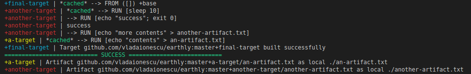

# 🌎 Earthly - a build system for the container era

**🛠 Build anything via containers** - *build container images or standalone artifacts (binaries, jars, gems, arbitrary files)*

**💻 Programming language agnostic** - *allows use of language-specific build tooling*

**♻️ Reproducible builds** - *does not depend on user's local installation. Runs the same locally, as in CI*

**⛓ Parallelism that just works** - *builds in parallel without special considerations the user has to make*

**🏠 Mono-repo friendly** - *ability to split the build definitions across a vast directory hierarchy*

**🏘 Multi-repo friendly** - *ability import builds or artifacts from other repositories*

----------------------------

## Dockerfile-like syntax

```Dockerfile
# Initialize the build environment - this applies to all targets.
FROM golang:1.13-alpine3.11
WORKDIR /go-example

build:
  # Copy source from local dir into the build context,
  # run go build and save the resulting binary.
  COPY main.go .
  RUN go build -o build/go-example main.go
  SAVE ARTIFACT build/go-example AS LOCAL build/go-example

docker:
  # Copy an artifact from target +build,
  # set an entrypoint for the image and save it.
  COPY +build/go-example .
  ENTRYPOINT ["/go-example/go-example"]
  SAVE IMAGE go-example:latest
```

Invoke the build using either `earth +build` (to build the binary) or `earth +docker` (to build the docker image).

## Installation

* **Linux** - As root, run:
   ```bash
   curl -o /usr/local/bin/earth -L https://github.com/vladaionescu/earthly-releases/releases/download/v0.0.4/earth-linux-amd64 && chmod +x /usr/local/bin/earth
   ```
* **Mac** - Run:
  ```bash
   curl -o /usr/local/bin/earth -L https://github.com/vladaionescu/earthly-releases/releases/download/v0.0.4/earth-darwin-amd64 && chmod +x /usr/local/bin/earth
   ```
* **Windows** - Coming soon

If you use SSH-based git authentication, then your git credentials will just work with Earthly.
Read more about git auth (TODO: Link).

## Example use

Write your own `build.earth` file. Build any target via

```bash
earth +target-name
```

You can also reference targets from other directories.

```bash
earth ./path/to/a/deep/dir+target-name
```

... or from other repositories.

```bash
# Build the target +earth-docker from the project github.com/vladaionescu/earthly.
# Run this anywhere, no need to clone repo first. Try it yourself!
earth github.com/vladaionescu/earthly+earth-docker
```

... or from a subdir of some repository.

```bash
earth github.com/vladaionescu/earthly/buildkitd+buildkitd
```

For more details on using the `earth` command, see `earth --help`.

## Core concepts

### Reference targets using `+`

```Dockerfile
build:
  # Build the target lint (defined in the same build.earth file).
  BUILD +lint
  # Inherit image from target +some-image available in ./some/deep/dir.
  FROM ./some/deep/dir+some-image
  # Execute the build of project github.com/some-user/some-project, with
  # the target +some-binary, copying the artifact out.
  COPY github.com/some-user/some-project+some-binary/out ./
  # Execute the build within the local directory ./some/deep/dir, with
  # the target +my-binary, copying the artifact bin.
  COPY ./some/deep/dir+my-binary/bin ./

lint:
  # ...
```

### Nothing is shared between build targets, other than images and artifacts

The container isolation prevents use of any resources specific to the local system.
This allows Earthly to completely parallelize the building of independent targets,
without any additional effort.

```Dockerfile
a-target:
  # Something complex and time-consuming.

another-target:
  # Something else complex and time-consuming.

final-target:
  # This will build the two targets in parallel.
  BUILD +a-target
  BUILD +another-target
  # So would this.
  COPY +a-target/an-artifact ./
  COPY +another-target/another-artifact ./
  # And so would this (or some other combination).
  FROM +a-target
  COPY +another-target/another-artifact ./
```

### Parallelization that just works


*Interleaved output shows execution of targets in parallel*

### A build either completely succeeds or completely fails

If some artifacts or images succeed, but others fail, the system does not ouptut any of them.
It also does not push partial results to registries or artifactories (unless the pushing operation
itself fails).

```Dockerfile
a-target:
	# ...
	SAVE ARTIFACT ./an-artifact AS LOCAL ./an-artifact

another-target:
	# ...
	SAVE ARTIFACT ./another-artifact AS LOCAL ./another-artifact

final-target:
	BUILD +a-target
	BUILD +another-target
```

When invoking `earth +final-target`, the system guarantees that an-artifact and another-artifact
either both are written as output, or none are.



*Outputting takes place below the `=== SUCCESS ===` line*

### Caching that works the same as docker builds

... in fact, the same [technology](https://github.com/moby/buildkit) is used underneath.


*The build picks up from the point it notices a difference in the code*

### Reusability with build args

```Dockerfile
lint:
  FROM golang:1.13-alpine3.11
  RUN go get golang.org/x/lint/golint
  ARG COPY_SRC
  COPY "$COPY_SRC" ./
  RUN golint -set_exit_status .

lint-project-a:
  BUILD --build-arg COPY_SRC=./project-a +lint

lint-project-b:
  BUILD --build-arg COPY_SRC=./project-b +lint
```

### Secrets support built-in

Secrets are never stored within an image's layers and they are only available to the commands
that need them.

```Dockerfile
some-target:
  RUN --push --secret GITHUB_TOKEN=+secrets/GITHUB_TOKEN github-release upload file.bin
```

```bash
earth --secret GITHUB_TOKEN --push +some-target
```

## Commands added on top of Dockerfile syntax


**`FROM`**

> Allows the classical syntax, as well as the additional `FROM +some-target` syntax, which
allows target inheritance.

**`COPY`**

> Allows the classical syntax for copying files from the build context, as well as the
additional `COPY +some-target/artifact-name ./dest/path` syntax, which allows copying artifacts
resulting from another target.

**`COPY --dir`**

> Behaves more like `cp -r` (copies the directories themselves, not just
the contents).

**`RUN --secret SOME_ENV_VAR=+secrets/SOME_SECRET`**

> Allows running with a secret
as an env var. The secret is not stored in the image's layers and is only available to that command.

**`RUN --entrypoint`**

> Runs the entrypoint of the image (useful when inheriting other targets,
in order to run the images as part of the build).

**`RUN --push`**

> Defines a push command. It never uses cache and only executes if the rest of the
b uild succeeds. Useful for triggering state change in remote environments (eg production) or for
pushing artifacts to artifactories.

**`BUILD +target`**

> Builds another target as part of the execution.

**`BUILD --build-arg SOME_ARG=some-value +target`**

> Builds another target, with specified value
for a build arg. The `--build-arg` flag is also available for `FROM +target` and
`COPY +target/artifact` commands.

**`BUILD --build-arg SOME_ARG=$(some command) +target`**

> Builds another target, with a build
arg value specified as the output of a command.

**`SAVE ARTIFACT ./artifact/path /artifact-name [AS LOCAL ./local/artifact/path]`**

> Saves an
artifact for later use. It is stored as a target artifact, to be used by other targets
(`/artifact-name`) and optionally, as a local file which will be written to the host system at
`./local/artifact/path`.

**`SAVE IMAGE [image/name:tag]`**

> Saves the current target as an image. It can be used by other
targets and also, optionally made available to the local system as docker image name
`image/name:tag`.

**`SAVE IMAGE --push image/name:tag`**

> Similar to above, but it additionally pushes the image
to the image registry.

**`GIT CLONE git@github.com:some-user/some-project.git dest-dir`**

> Clones the git project into
directory `dest-dir`. The difference from doing `RUN git clone ...` is that it is cache-aware,
thus building again when the git hash is different.

**`RUN --with-docker docker ...`** [**experimental**]

> Allows running commands in the presence of a
docker daemon, as part of the build. The main use-case for this is running complex integration
tests where several containers need to be running in parallel.

**`DOCKER PULL some-image`** [**experimental**]

> Allows pulling a remote image into the context of the
build. (Can then run the image via `RUN --with-docker docker run some-image`). This command
is cache-aware compared to `RUN --with-docker docker pull some-image`.

**`DOCKER LOAD +some-target AS image-name`** [**experimental**]

> Allows using an Earthly target as a docker image loaded into the context of the build.

For more details see the earthfile reference (TODO: link to reference).

## Why

TODO: Simplify this by moving details into launch blog post. Keep only the essence here.

Why does the world need a new build system?

We live in an era of containers, CI/CD, automation, rich set of programming languages, varying code structures (mono/poly-repos) and open-source collaboration. None of the build systems out there serve well these new trends:

* They don't take advantage of container-based isolation to make the builds portable
* Builds are not easily reproducible - they often depend on already installed dependencies
* They don't provide a way to import open-source recipes
* Many are programming language-specific, making them unattractive to be used as a one-stop-shop
* Parallelization ranges from difficult to almost impossible
* Importing and reusability are primitive or difficult to use across repos
* Caching is difficult to master, making it impossible to scale the build system in a mono-repo
* They are difficult to use, leading to a build system guru situation (only one person knows how the build works)
* Or a combination of the above.

Of the popular choices out there, the options that come close are [Bazel](https://bazel.build/) and [Dockerfiles](https://docs.docker.com/engine/reference/builder/). Both are excellent, yet there are challenges: Bazel is difficult to adopt because it requires an all-in approach (are you ready to completely rewrite the build.gradle's in your org into [Bazel BUILD files](https://docs.bazel.build/versions/master/tutorial/java.html)?). Dockerfiles are great, but they only output images. You can subsequently use docker run commands and mounted volumes to output other kinds of artifacts - but that requires that you now wrap your docker builds into Makefiles or some other build system.

Earthly accepts the reality that for some languages, the best build system is provided by the community of that language (like gradle, webpack, sbt etc), yet it adds the Dockerfile-like caching on top, plus more flexibility in defining hierarchies of dependencies for caching and reusability.

### Benefits

Here's what you get with Earthly:

* Consistent environment between developers and with CI
* Programming language agnostic
* No need to install project-specific dependencies - the build is self-contained
* First-party support for Docker
* Syntax easy to understand even with no previous experience
* Efficient use of caching, that is easy to understand by anyone
* Simple parallelism, without the gnarly race conditions
* Like a docker build but it can also yield classical artifacts (packages, binaries etc)
  owned by the user, not by root
* Mono-repo friendly (reference targets within subdirs, with no strings attached)
* Multi-repo friendly (reference targets in other repos just as easily)
* In a complex setup, ability to trigger rebuild of only affected targets and tests
* An import system that is easy to use and has no hidden implications

## Dive in

... TODO
