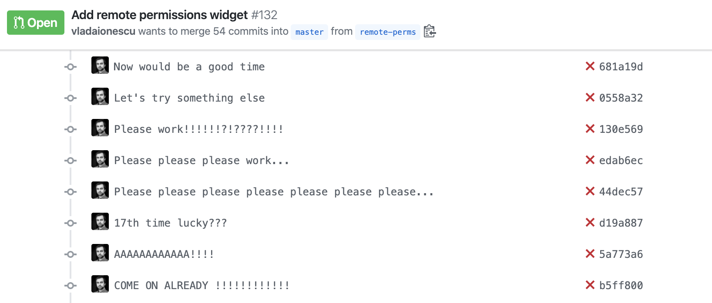
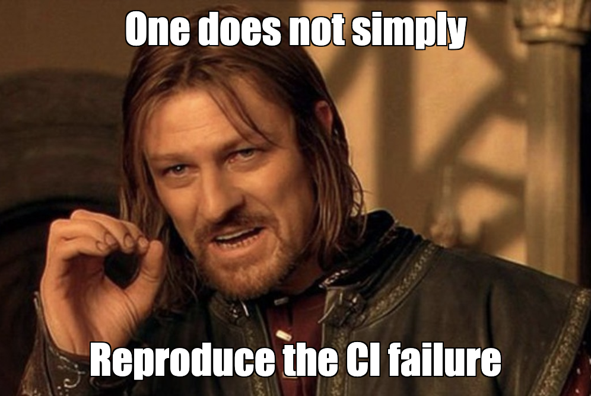
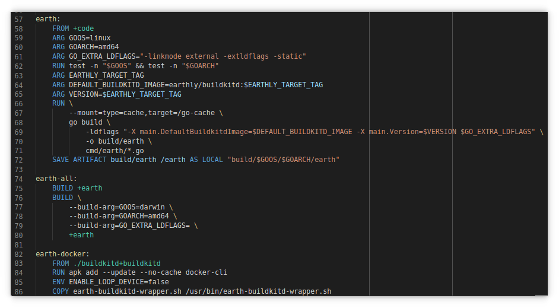
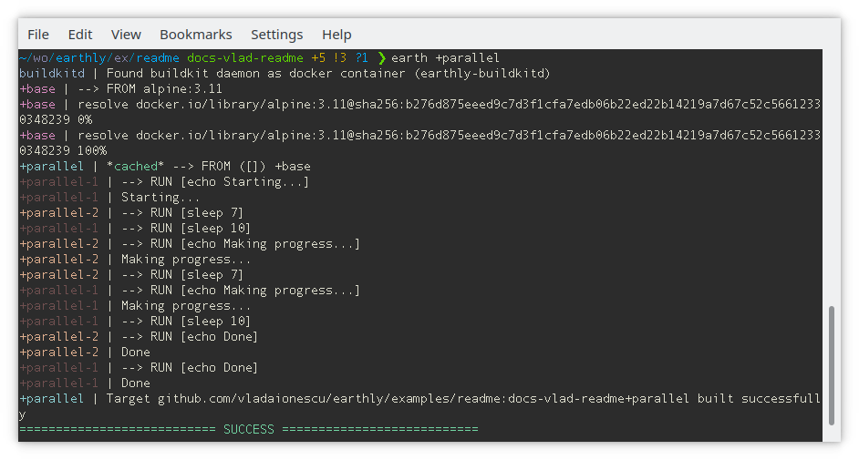
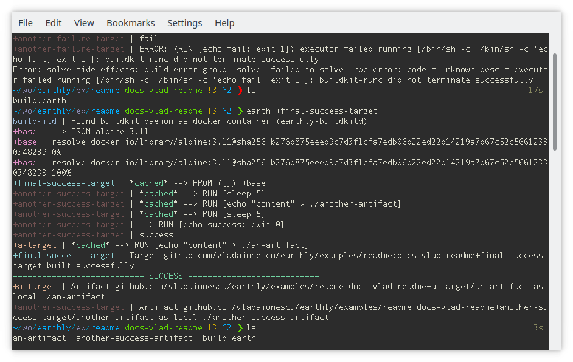
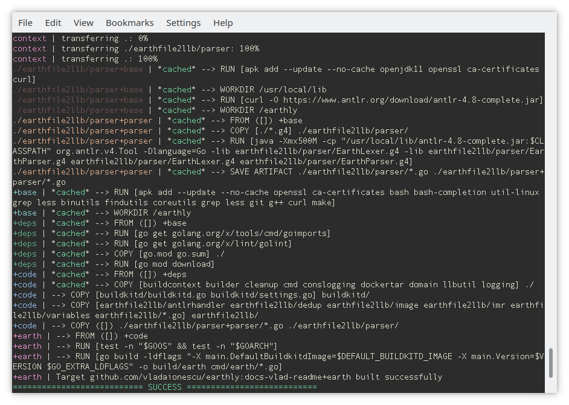

# Earthly - build automation for the container era

**🐳 Build anything via containers** - *build container images or standalone artifacts (eg binaries, packages, arbitrary files)*

**🛠 Programming language agnostic** - *allows use of language-specific build tooling*

**♻️ Reproducible builds** - *does not depend on user's local installation. Runs the same locally, as in CI*

**⛓ Parallelism that just works** - *builds in parallel without special considerations the user has to make*

**🏠 Mono-repo friendly** - *ability to split the build definitions across a vast directory hierarchy*

**🏘 Multi-repo friendly** - *ability to import builds or artifacts from other repositories*

**⚙️ Works with your CI** - *can run on top of popular CIs like Circle CI and GitHub Actions*

----------------------------

[](https://goreportcard.com/report/github.com/vladaionescu/earthly)
[](https://gitter.im/earthly-room/community?utm_source=badge&utm_medium=badge&utm_campaign=pr-badge&utm_content=badge)
[](https://docs.earthly.dev)
[](https://hub.docker.com/u/earthly)
[](http://www.apache.org/licenses/LICENSE-2.0)

### Aren't you tired of debugging builds that you cannot run locally?



----------------------------

Earthly is a build automation tool from the same era as your code. It allows you to execute all your builds in containers. This makes them self-contained, reproducible, portable and parallel. You can use Earthly to create Docker images and artifacts (eg binaries, packages, arbitrary files).

Earthly can run on top of popular CI systems (like Jenkins, [Circle](https://docs.earthly.dev/examples/circle-integration), [GitHub Actions](https://docs.earthly.dev/examples/gh-actions-integration)). It is typically the [layer](https://docs.earthly.dev) between language-specific tooling (like maven, gradle, npm, pip, go build) and the CI build spec.

Earthly's syntax is kinda like Dockerfile and Makefile had a baby.

To learn how to use Earthly, check out the [getting started guide](https://docs.earthly.dev/guides/basics).

For some examples, see [Go](https://docs.earthly.dev/examples/go), [Java](https://docs.earthly.dev/examples/java), [JS](https://docs.earthly.dev/examples/js), [Mono-repo](https://docs.earthly.dev/examples/monorepo), [Multi-repo](https://docs.earthly.dev/examples/multirepo), [Earthly's own build](https://docs.earthly.dev/examples/earthly) or the [examples dir](./examples).

<h2 align="center">Installation</h2>

##### Pre-requisites (all platforms)

* [Docker](https://docs.docker.com/install/)
* [Git](https://git-scm.com/book/en/v2/Getting-Started-Installing-Git)

##### Linux

```bash
sudo /bin/sh -c 'curl -s https://api.github.com/repos/vladaionescu/earthly/releases/latest | grep browser_download_url | grep linux-amd64 | cut -d : -f 2- | tr -d \" | wget -P /usr/local/bin/ -i - && mv /usr/local/bin/earth-linux-amd64 /usr/local/bin/earth && chmod +x /usr/local/bin/earth'
```

##### Mac

```bash
curl -s https://api.github.com/repos/vladaionescu/earthly/releases/latest | grep browser_download_url | grep darwin-amd64 | cut -d : -f 2- | tr -d \" | wget -P /usr/local/bin/ -i - && mv /usr/local/bin/earth-darwin-amd64 /usr/local/bin/earth && chmod +x /usr/local/bin/earth
```

##### Windows

Coming soon.

##### Note

If you use SSH-based git authentication, then your git credentials will just work with Earthly. Read more about [git auth](https://docs.earthly.dev/guides/auth).

##### VS Code extension for syntax highlighting

[](https://marketplace.visualstudio.com/items?itemName=earthly.earthfile-syntax-highlighting)

Add [Earthfile Syntax Highlighting](https://marketplace.visualstudio.com/items?itemName=earthly.earthfile-syntax-highlighting) to VS Code.

```
ext install earthly.earthfile-syntax-highlighting
```

<h2 align="center">Core features</h2>

#### 🐳 Dockerfile-like syntax

```Dockerfile
# Initialize the build environment - this applies to all targets.
FROM golang:1.13-alpine3.11
WORKDIR /go-example

build:
  # Copy source from local dir into the build environment,
  # run go build and save the resulting binary.
  COPY main.go .
  RUN go build -o build/go-example main.go
  SAVE ARTIFACT build/go-example AS LOCAL build/go-example

docker:
  # Copy an artifact from target +build,
  # set an entrypoint for the image and save it.
  COPY +build/go-example .
  ENTRYPOINT ["/go-example/go-example"]
  SAVE IMAGE go-example:latest
```

Invoke the build using either `earth +build` (to build the binary) or `earth +docker` (to build the docker image).

#### 🔨 Reference targets using +

```Dockerfile
build:
  # Build the target lint (defined in the same build.earth file).
  BUILD +lint
  # Inherit image from target +some-image available in ./some/deep/dir.
  FROM ./some/deep/dir+some-image
  # Execute the build of project github.com/some-user/some-project, with
  # the target +some-binary, copying the artifact out.
  COPY github.com/some-user/some-project+some-binary/out ./
  # Execute the build within the local directory ./some/deep/dir, with
  # the target +my-binary, copying the artifact bin.
  COPY ./some/deep/dir+my-binary/bin ./

lint:
  # ...
```

#### 📦 Nothing is shared between build targets, other than images and artifacts

The container isolation prevents use of any resources specific to the local system. This allows Earthly to completely parallelize the building of independent targets, without any additional effort.

```Dockerfile
a-target:
  # Something complex and time-consuming.

another-target:
  # Something else complex and time-consuming.

final-target:
  # This will build the two targets in parallel.
  BUILD +a-target
  BUILD +another-target
  # So would this.
  COPY +a-target/an-artifact ./
  COPY +another-target/another-artifact ./
  # And so would this (or some other combination).
  FROM +a-target
  COPY +another-target/another-artifact ./
```

#### ⛓ Parallelization that just works



*Interleaved output shows execution of targets in parallel*

#### ✔️ A build either completely succeeds or completely fails

If some artifacts or images succeed, but others fail, the system does not ouptut any of them. It also does not push partial results to registries or artifactories (unless the pushing operation itself fails).



*Outputting only takes place below the `=== SUCCESS ===` line*

#### 💾 Caching that works the same as docker builds

... in fact, the same [technology](https://github.com/moby/buildkit) is used underneath.



*The build picks up from the point it notices a difference in the code*

#### 🛠 Reusability with build args

```Dockerfile
lint:
  FROM golang:1.13-alpine3.11
  RUN go get golang.org/x/lint/golint
  ARG COPY_SRC
  COPY "$COPY_SRC" ./
  RUN golint -set_exit_status .

lint-project-a:
  BUILD --build-arg COPY_SRC=./project-a +lint

lint-project-b:
  BUILD --build-arg COPY_SRC=./project-b +lint
```

#### 🔑 Secrets support built-in

Secrets are never stored within an image's layers and they are only available to the commands that need them.

```Dockerfile
some-target:
  RUN --push --secret GITHUB_TOKEN=+secrets/GITHUB_TOKEN github-release upload file.bin
```

```bash
earth --secret GITHUB_TOKEN --push +some-target
```

<h2 align="center">Example usage of earth command</h2>

Write your own `build.earth` file, then build any target via

```bash
earth +target-name
```

You can also reference targets from other directories.

```bash
earth ./path/to/a/deep/dir+target-name
```

... or from other repositories.

```bash
# Try it yourself! No need to clone.
earth github.com/vladaionescu/earthly+earth-docker
```

... or from a subdir of some repository.

```bash
# Try it yourself! No need to clone.
earth github.com/vladaionescu/earthly/buildkitd+buildkitd
```

[](https://asciinema.org/a/314104)

For more details on using the `earth` command, see `earth --help`.


<h2 align="center">Commands beyond Dockerfile syntax</h2>


##### `FROM`

> Allows the classical syntax, as well as the additional `FROM +some-target` syntax, which allows target inheritance.

##### `COPY`

> Allows the classical syntax for copying files from the build context, as well as the additional `COPY +some-target/artifact-name ./dest/path` syntax, which allows copying artifacts resulting from another target.

##### `COPY --dir`

> Behaves more like `cp -r` (copies the directories themselves, not just the contents).

##### `RUN --secret SOME_ENV_VAR=+secrets/SOME_SECRET`

> Allows running with a secret as an env var. The secret is not stored in the image's layers and is only available to that command.

##### `RUN --entrypoint`

> Runs the entrypoint of the image (useful when inheriting other targets, in order to run the images as part of the build).

##### `RUN --push`

> Defines a push command. It never uses cache and only executes if the rest of the build succeeds. Useful for triggering state change in remote environments (eg production) or for pushing artifacts to artifactories.

##### `BUILD +target`

> Builds another target as part of the execution.

##### `BUILD --build-arg SOME_ARG=some-value +target`

> Builds another target, with specified value for a build arg. The `--build-arg` flag is also available for `FROM +target` and `COPY +target/artifact` commands.

##### `BUILD --build-arg SOME_ARG=$(some command) +target`

> Builds another target, with a build arg value specified as the output of a command.

##### `SAVE ARTIFACT ./artifact/path [/artifact-name] [AS LOCAL ./local/artifact/path]`

> Saves an artifact for later use. It is stored as a target artifact, to be used by other targets (`/artifact-name`) and optionally, as a local file which will be written to the host system at `./local/artifact/path`.

##### `SAVE IMAGE [image/name:tag]`

> Saves the current target as an image. It can be used by other targets and also, optionally made available to the local system as docker image name `image/name:tag`.

##### `SAVE IMAGE --push image/name:tag`

> Similar to above, but it additionally pushes the image to the image registry.

##### `GIT CLONE git@github.com:some-user/some-project.git dest-dir`

> Clones the git project into directory `dest-dir`. The difference from doing `RUN git clone ...` is that it is cache-aware, thus building again when the git hash is different.

##### `RUN --with-docker docker ...` [**experimental**]

> Allows running commands in the presence of a docker daemon, as part of the build. The main use-case for this is running complex integration tests where several containers need to be running in parallel.

##### `DOCKER PULL some-image` [**experimental**]

> Allows pulling a remote image into the context of the build. (Can then run the image via `RUN --with-docker docker run some-image`). This command is cache-aware compared to `RUN --with-docker docker pull some-image`.

##### `DOCKER LOAD +some-target AS image-name` [**experimental**]

> Allows using an Earthly target as a docker image loaded into the context of the build.

For more details see the [Earthfile reference](https://docs.earthly.dev/earthfile).

<h2 align="center">What's next?</h2>

To learn more about using Earthly, check the [full documentation](https://docs.earthly.dev/), which includes

* [Getting started](https://docs.earthly.dev/guides/basics)
* [Earthfile reference](https://docs.earthly.dev/earthfile)
* [earth command reference](https://docs.earthly.dev/earth-command)
* [Examples](https://docs.earthly.dev/examples)
* [CI integration guide](https://docs.earthly.dev/guides/ci-integration)

<h2 align="center">FAQ</h2>

##### Can I just use docker build instead of Earthly?

You might. There are docker build features such as `--target` and `-o` and `FROM ... AS ...` which give you part of Earthly's functionality. However, docker build was not designed to be used as a full-on build system, but rather as a tool to build container images primarily. You will always end up wrapping docker build's in scripts like bash and Makefile to make it do what you need to: eg building regular files, passing the right tags for images, importing files from other repositories etc. Historically such scripts are typically only understood by a fraction of the team, leading to a build guru situation: only one person knows how the build works. There are, however, situations where using docker build alone is more advisable. For example, docker build is a very mature command and has been battle-tested. Also in some environments, only a very trivial build may be needed and installing yet another tool for it may be overkill.

##### How do I tell apart classical Dockerfile commands from Earthly commands

Check out the [Earthfile reference doc page](https://docs.earthly.dev/earthfile). It has all the commands there and it specifies which commands are the same as Dockerfile commands and which are new.

##### Can Earthly build Dockerfiles

It cannot - however, translating Dockerfiles to Earthfiles (`build.earth`) is usually a matter of copy-pasting and making small adjustments. See the [getting started page](https://docs.earthly.dev/guides/basics) for some Earthfile examples.

<h2 align="center">Contributing</h2>

* Please report bugs as [GitHub issues](https://github.com/vladaionescu/earthly/issues).
* Join us on [Gitter](https://gitter.im/earthly-room/community)!
* Questions via GitHub issues are welcome!
* PRs welcome! But please give a heads-up in GitHub issue before starting work. If there is no GitHub issue for what you want to do, please create one.
* To build from source, you will need the `earth` binary ([Earthly builds itself](https://docs.earthly.dev/examples/earthly)). Git clone the code and run `earth +all`.

<h2 align="center">Licensing</h2>

Earthly is licensed under the Mozilla Public License Version 2.0. See [LICENSE](./LICENSE) for the full license text.
