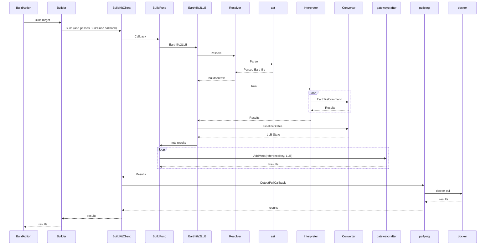

Here is a rough diagram of an earthly target being built from the perspective of the initial build cli command:

Gotchas:
 - If the converter encounters a reference to a different earthly target (e.g. `FROM +other-target`, or `BUILD child+target`), it will recurse into `Earthfile2LLB`.
 - This diagram does not cover any of the `WAIT` / `END` logic, which causes the `FinalizeStates` method to block on any outstanding tasks (`WaitItem`s).
   When a `WaitItem` is blocked on a `SAVE IMAGE`, the `Converter` will indirectly call the `gatewaycrafter` and forward on the LLB and reference keys to buildkit's gatewayclient, which
   will then ultimately call the pullping callback. All of this happens within the context of the `BuildFunc`, before it has a chance to return.
