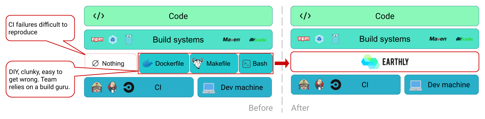

# Introduction

Earthly is a build automation tool from the same era as your code. It allows you to execute all your builds in containers. This makes them self-contained, reproducible, portable and parallel. You can use Earthly to create Docker images and artifacts (eg binaries, packages, arbitrary files).

Earthly can run on top of popular CI systems (like Jenkins, [Circle](./examples/circle-integration.md), [GitHub Actions](./examples/gh-actions-integration.md)). It is typically the layer between language-specific tooling (like maven, gradle, npm, pip, go build) and the CI build spec.

Earthly's syntax is kinda like Dockerfile and Makefile had a baby.

Earthly has a number of key features. Everything runs on containers, so your builds run the same on your laptop as they run in CI or on your colleague's laptop. Strong isolation also gives you easy to use parallelism, with no strings attached. You can also import dependencies from other directories or other repositories with ease, making Earthly great for large [mono-repo builds](./examples/monorepo.md) that span a vast directory hierarchy; but also for [multi-repo setups](./examples/multirepo.md) where builds might depend on each other across repositories.

One of the key principles of Earthly is that the best build tooling of a specific language is built by the community of that language itself. Earthly does not intend to replace that tooling, but rather to leverage and augment it.

## Installation

To install `earth` (the Earthly CLI) on your system, see [instructions on the Earthly GitHub page](https://github.com/vladaionescu/earthly#installation).

You may optionally also install the [VS Code Syntax Highlighting extension](https://marketplace.visualstudio.com/items?itemName=earthly.earthfile-syntax-highlighting).

## Getting started

If you are new to Earthly, check out the [Basics page](./guides/basics.md), to get started.

A high-level overview is available on [the Earthly GitHub page](https://github.com/vladaionescu/earthly).

## Quick Links

* [Earthly GitHub page](https://github.com/vladaionescu/earthly)
* [Earthly basics](./guides/basics.md)
* [Earthfile reference](./earthfile/earthfile.md)
* [earth command reference](./earth-command/earth-command.md)
* [Earthfile examples](./examples/examples.md)
