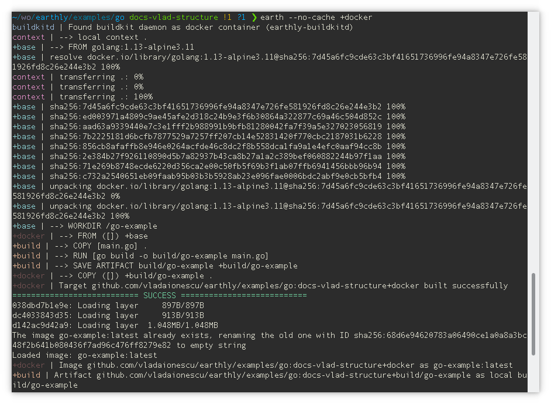

Below you'll find a simple example of an Earthfile. All the magic of Earthly happens in the Earthfile, which you may notice is very similar to a Dockerfile. This is an intentional design decision. Existing Dockerfiles can easily be ported to Earthly by copying them to an Earthfile and tweaking them slightly.

```Dockerfile
VERSION 0.8
FROM golang:1.15-alpine3.13
WORKDIR /go-workdir

build:
    COPY main.go .
    RUN go build -o output/example main.go
    SAVE ARTIFACT output/example AS LOCAL local-output/go-example

docker:
    COPY +build/example .
    ENTRYPOINT ["/go-workdir/example"]
    SAVE IMAGE go-example:latest
```

Throughout this tutorial, we'll build up this example Earthfile from scratch and then add even more to it. By the end you'll have a better grasp of how Earthly works and the power and repeatability it can bring to your build process.

This tutorial focuses on using Earthly with a Go project, but you can find examples of Earthfiles for [Python](#more-examples), [JavaScript](#more-examples) and [Java](#more-examples) at the bottom of each page.

To copy the files for [this example ( Part 1 )](https://github.com/earthly/earthly/tree/main/examples/tutorial/go/part1) run

```bash
mkdir tutorial
cd tutorial
earthly --artifact github.com/earthly/earthly/examples/tutorial/go:main+part1/part1 ./part1
```

## Creating Your First Earthfile

We'll slowly build up to the Earthfile we have above. Let's start with these first three lines.

`./tutorial/Earthfile`
```Dockerfile
VERSION 0.8
FROM golang:1.15-alpine3.13
WORKDIR /go-workdir
```
And some simple Hello World code in a `main.go`.

```go
package main

import "fmt"

func main() {
	fmt.Println("hello world")
}
```
Earthfiles are always named Earthfile, regardless of their location in the codebase. 
The Earthfile starts off with a version definition. This will tell Earthly which features to enable and which ones not to so that the build script maintains compatibility over time, even if Earthly itself is updated.

The first commands in the file are part of the `base` target and are implicitly inherited by all other targets. Targets are just sets of instructions we can call on from within the Earthfile, or when we run Earthly at the command line. Targets need an environment to run in. These environments come in the form of Docker images. In this case we are saying that all the instructions in our Earthfile will use `golang:1.15-alpine3.13`, [unless we specify otherwise](#target-environments). (More on this in a bit.)

Lastly, we change our working directory to `/go-workdir`.

## Creating Your First Targets
Earthly aims to replace Dockerfile, makefile, bash scripts and more. We can take all the setup, configuration and build steps we'd normally define in those files and put them in our Earthfile in the form of `targets`.

Let's start by defining a target to build our simple Go app. **When we run Earthly, we can tell it to execute a target by passing a plus sign (+) and then the target name.** So we'll be able to run our `build` target with `earthly +build`.  More on this in the [Running the Build](#running-the-build) section.

Let's start by breaking down our first target.

```Dockerfile
build:
    COPY main.go .
    RUN go build -o output/example main.go
    SAVE ARTIFACT output/example
```

The first thing we do is copy our `main.go` from the **build context** (the directory where the Earthfile resides) to the **build environment** (the containerized environment where Earthly commands are run).

Next, we run a go build command against the previously copied `main.go` file.

Finally, we save the output of the build command as an artifact. The syntax for `SAVE ARTIFACT` defaults the destination path to `/` - so our artifact will be called `/example` (it can be later referenced as `+build/example`). If we wanted to save it at a different path, we could use `SAVE ARTIFACT output/example /some/path/to/example` and refer to it later as `+build/some/path/to/example`.

Now let's create a new target called `+docker`.

```Dockerfile
docker:
    COPY +build/example .
    ENTRYPOINT ["/go-workdir/example"]
    SAVE IMAGE go-example:latest
```
Here we copy the artifact `/example` produced by another target, `+build`, to the current directory within the build environment. Again this will be the working directory we set up in the `base` target at the beginning of the file. Lastly, we set the entrypoint for the resulting docker image, and then save the image.

You may notice the command `COPY +build/... ...`, which has an unfamiliar form if you're coming from Docker. This is a special type of `COPY`, which can be used to pass artifacts from one target to another. In this case, the target `build` (referenced as `+build`) produces an artifact, which has been declared with `SAVE ARTIFACT`, and the target `docker` copies that artifact in its build environment.

With Earthly you have the ability to pass such artifacts or images between targets within the same Earthfile, but also across different Earthfiles across directories or even across repositories. To read more about this, see the [importing guide](../guides/importing.md) or jump to [part 5](./part-5-importing.md) of this guide.

Lastly, we save the current state as a docker image, which will have the docker tag `go-example:latest`. This image is only made available to the host's docker if the entire build succeeds.

## Target Environments

Notice how we already had Go installed for both our `+build` and `+docker` targets. This is because  targets inherit from the base target which for us was the `FROM golang:1.15-alpine3.13` that we set up at the top of the file. But it's worth noting that targets can define their own environments. For example:

```Dockerfile
VERSION 0.8
FROM golang:1.15-alpine3.13
WORKDIR /go-workdir

build:
    COPY main.go .
    RUN go build -o output/example main.go
    SAVE ARTIFACT output/example AS LOCAL local-output/go-example

npm:
    FROM node:12-alpine3.12
    WORKDIR /src
    RUN npm install
    COPY assets/ .
    RUN npm test
```

In this example, the `+build` target does not have a `FROM`, so it inherits from the base target, `golang:1.15-alpine3.13`. 

The target `+npm`, on the other hand, specifies its own environment with the `FROM`command and so will run inside of a `node:12-alpine3.12` container.

## Running the build

In the example `Earthfile` we have defined two explicit targets: `+build` and `+docker`. **We can tell Earthly to execute a target by passing typing a plus sign (+) followed by the target name.** In this case our docker target calls on our build target, so we can run both with:

```bash
earthly +docker
```
The output might look like this:



Notice how to the left of `|`, within the output, we can see some targets like `+base`, `+build` and `+docker` . Notice how the output is interleaved between `+docker` and `+build`. This is because the system executes independent build steps in parallel. The reason this is possible effortlessly is because only very few things are shared between the builds of the recipes and those things are declared and obvious. The rest is completely isolated.

In addition, notice how even though the base is used as part of both `build` and `docker`, it is only executed once. This is because the system deduplicates execution, where possible.

Furthermore, the fact that the `docker` target depends on the `build` target is visible within the command `COPY +build/...`. Through this command, the system knows that it also needs to build the target `+build`, in order to satisfy the dependency on the artifact.

Finally, notice how the output of the build (the docker image and the files) are only written after the build is declared a success. This is due to another isolation principle of Earthly: a build either succeeds completely or it fails altogether.

Once the build has executed, we can run the resulting docker image to try it out:

```
docker run --rm go-example:latest

# or podman
podman run --rm go-example:latest
```

### More Examples
<details open>
<summary>JavaScript</summary>

To copy the files for [this example ( Part 1 )](https://github.com/earthly/earthly/tree/main/examples/tutorial/js/part1) run

```bash
mkdir tutorial
cd tutorial
earthly --artifact github.com/earthly/earthly/examples/tutorial/js:main+part1/part1 ./part1
```

`./Earthfile`

```Dockerfile
VERSION 0.8
FROM node:13.10.1-alpine3.11
WORKDIR /js-example

build:
    # In JS, there's nothing to build in this simple form.
    # The source is also the artifact used in production.
    COPY src/index.js .
    SAVE ARTIFACT index.js /dist/index.js

docker:
    COPY +build/dist dist
    ENTRYPOINT ["node", "./dist/index.js"]
    SAVE IMAGE js-example:latest
```

The code of the app might look like this

`./src/index.js`

```js
console.log("hello world");
```

</details>


<details open>
<summary>Java</summary>

To copy the files for [this example ( Part 1 )](https://github.com/earthly/earthly/tree/main/examples/tutorial/java/part1) run

```bash
mkdir tutorial
cd tutorial
earthly --artifact github.com/earthly/earthly/examples/tutorial/java:main+part1/part1 ./part1
```

`./Earthfile`

```Dockerfile
VERSION 0.8
FROM openjdk:8-jdk-alpine
RUN apk add --update --no-cache gradle
WORKDIR /java-example

build:
    COPY build.gradle ./
    COPY src src
    RUN gradle build
    RUN gradle install
    SAVE ARTIFACT build/install/java-example/bin /bin
    SAVE ARTIFACT build/install/java-example/lib /lib

docker:
    COPY +build/bin bin
    COPY +build/lib lib
    ENTRYPOINT ["/java-example/bin/java-example"]
    SAVE IMAGE java-example:latest
```

The code of the app might look like this

`./src/main/java/hello/HelloWorld.java`

```java

package hello;

public class HelloWorld {
    public static void main(String[] args) {
        System.out.println("hello world");
    }
}
```

`./build.gradle`

```groovy
apply plugin: 'java'
apply plugin: 'application'

mainClassName = 'hello.HelloWorld'

jar {
    baseName = 'hello-world'
    version = '0.0.1'
}

sourceCompatibility = 1.8
targetCompatibility = 1.8
```
</details>


<details open>
<summary>Python</summary>

To copy the files for [this example ( Part 1 )](https://github.com/earthly/earthly/tree/main/examples/tutorial/python/part1) run

```bash
mkdir tutorial
cd tutorial
earthly --artifact github.com/earthly/earthly/examples/tutorial/python:main+part1/part1 ./part1
```

`./Earthfile`

```Dockerfile
VERSION 0.8
FROM python:3
WORKDIR /code

build:
     # In Python, there's nothing to build.
    COPY src src
    SAVE ARTIFACT src /src

docker:
    COPY +build/src src
    ENTRYPOINT ["python3", "./src/hello.py"]
    SAVE IMAGE python-example:latest
```

The code of the app might look like this

`./src/hello.py`

```python
print("hello world")
```

</details>
