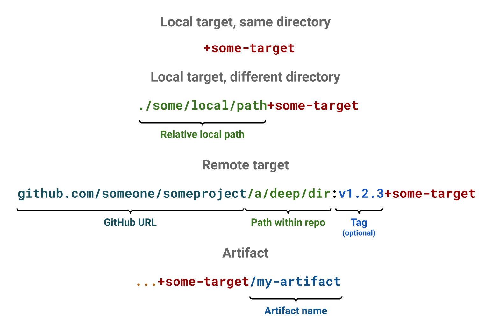

# A simple Earthfile

Earthfiles are always named `Earthfile`, regardless of their location in the codebase.



Here is a sample earthfile of a Go app

```Dockerfile
# Earthfile

FROM golang:1.15-alpine3.13
WORKDIR /go-example

build:
    COPY main.go .
    RUN go build -o build/go-example main.go
    SAVE ARTIFACT build/go-example /go-example AS LOCAL build/go-example

docker:
    COPY +build/go-example .
    ENTRYPOINT ["/go-example/go-example"]
    SAVE IMAGE go-example:latest
```

The code of the app might look like this

```go
// main.go

package main

import "fmt"

func main() {
	fmt.Println("hello world")
}
```


Here is a sample earthfile of a JS app

```Dockerfile
# Earthfile

FROM node:13.10.1-alpine3.11
WORKDIR /js-example

build:
    # In JS, there's nothing to build in this simple form.
    # The source is also the artifact used in production.
    COPY index.js .
    SAVE ARTIFACT index.js /dist/index.js AS LOCAL ./dist/index.js

docker:
    COPY +build/dist dist
    ENTRYPOINT ["node", "./dist/index.js"]
    SAVE IMAGE js-example:latest
```

The code of the app might look like this

```js
// index.js

console.log("hello world");
```


Here is a sample earthfile of a Java app

```Dockerfile
# Earthfile

FROM openjdk:8-jdk-alpine
RUN apk add --update --no-cache gradle
WORKDIR /java-example

build:
    COPY build.gradle ./
    COPY src src
    RUN gradle build
    RUN gradle install
    SAVE ARTIFACT build/install/java-example/bin /bin AS LOCAL build/bin
    SAVE ARTIFACT build/install/java-example/lib /lib AS LOCAL build/lib

docker:
    COPY +build/bin bin
    COPY +build/lib lib
    ENTRYPOINT ["/java-example/bin/java-example"]
    SAVE IMAGE java-example:latest
```

The code of the app might look like this

```java
// src/main/java/hello/HelloWorld.java

package hello;

public class HelloWorld {
    public static void main(String[] args) {
        System.out.println("hello world");
    }
}
```

Here is a sample earthfile of a Python app

```Dockerfile
# Earthfile

FROM python:3
WORKDIR /code

build:
     # In Python, there's nothing to build.
    COPY src src
    SAVE ARTIFACT src /src

docker:
    COPY +build/src src
    ENTRYPOINT ["python3", "./src/hello.py"]
    SAVE IMAGE python-example:latest
```

The code of the app might look like this

```python
// src/hello.py

print("hello world")
```


You will notice that the recipes look very much like Dockerfiles. This is an intentional design decision. Existing Dockerfiles can be ported to earthfiles by copy-pasting them over and then tweaking them slightly. Compared to Dockerfile syntax, some commands are new (like `SAVE ARTIFACT`), others have additional semantics (like `COPY +target/some-artifact`) and other semantics have been removed (like `FROM ... AS ...` and `COPY --from`).

You might notice the command `COPY +build/... ...`, which has an unfamiliar form. This is a special type of `COPY`, which can be used to pass artifacts from one target to another. In this case, the target `build` (referenced as `+build`) produces an artifact, which has been declared with `SAVE ARTIFACT`, and the target `docker` copies that artifact in its build environment.

With Earthly you have the ability to pass such artifacts or images between targets within the same Earthfile, but also across different Earthfiles across directories or even across repositories. To read more about this, see the [target, artifact and image referencing guide](../guides/target-ref.md).



## Continue tutorial

👉 [Part 2: Executing a build](./part-2-executing-a-build.md)
