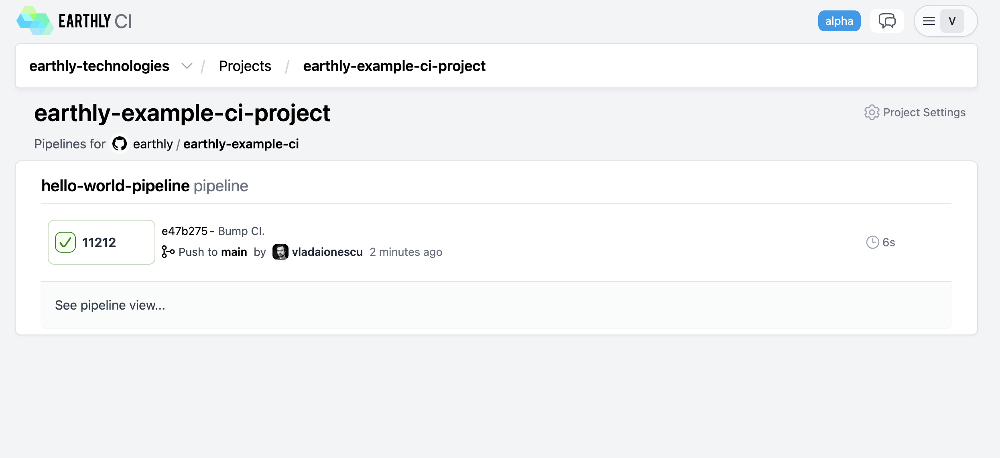
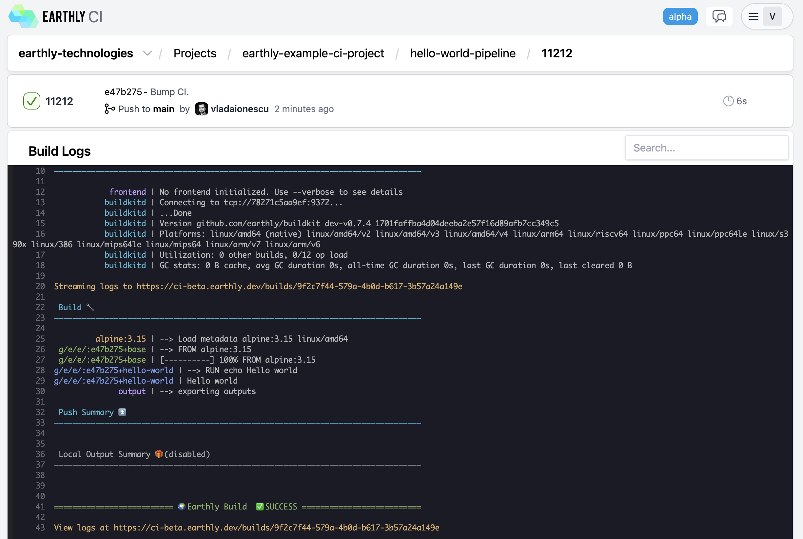

*The code of this example is available in the [earthly/earthly-example-ci repository on GitHub](https://github.com/earthly/earthly-example-ci).*

An alternative to using a traditional CI system is to use Earthly CI. With Earthly CI, you don't need any other build specification other than the Earthfile. Earthly CI uses the same technology underneath as Earthly Satellites, which means that it is dramatically faster than traditional CI systems through the use of its instantly-available cache.

Earthly CI is a [paid feature](https://earthly.dev/pricing), although there is a 14-day free trial available. This section will walk you through the steps to get started with Earthly CI.

## Getting Started with Earthly CI

To get started with Earthly CI, you need to first create an Earthly Cloud account, if you haven't already. You can do so by running the following command:

```bash
earthly account register --email <your-email>
```

Follow instructions in the email received to complete the registration. You will additionally need to create an organization.

```bash
earthly org create my-org
```

You must subscribe to a paid plan to use Earthly CI. The subscription has a 14-day trial -- your credit card is not charged if you cancel before then.

[**Click here to start your subscription**](https://buy.stripe.com/dR6g2Qect2Nn5KE3cf)

Then, you can access the Earthly Web UI by running...

```bash
earthly web
```

This will associate your Earthly account with your GitHub login and then take you to the Earthly Web UI.

## Defining an Earthly CI Pipeline

An Earthly CI pipeline is defined as an Earthly target that begins with the command `PIPELINE`. Here is an example:

```Earthfile
VERSION 0.7
PROJECT my-org/my-project

FROM alpine:3.17

hello-world-pipeline:
    PIPELINE
    TRIGGER push main
    TRIGGER pr main
    BUILD +hello-world

hello-world:
    RUN echo Hello world
```

In this example, we have declared a pipeline called `hello-world-pipeline`. This pipeline will be triggered on every push to the `main` branch, and on the commits within every pull request intending to merge into the `main` branch. The pipeline will run the target `+hello-world`, which simply prints out `Hello world`.

To get this pipeline to run, you will need to add the Earthfile to a GitHub repository in the default branch (typically `main`).

After you've committed your Earthfile, go back to the Earthly Web UI to create a new project, and add the repository to the project. Please note that the `PROJECT` declaration in the Earthfile needs to match the organization name and project name in the Earthly Web UI.

The pipeline should start executing automatically. Its status can be seen in the Earthly Web UI.





Earthly CI pipelines can also be executed locally the same way as any other Earthly target. This is useful for testing the pipeline locally before pushing it to the repository.

```bash
earthly +hello-world-pipeline
```

To read more about Earthly CI, check out the [Earthly CI page](../cloud/earthly-ci.md).
