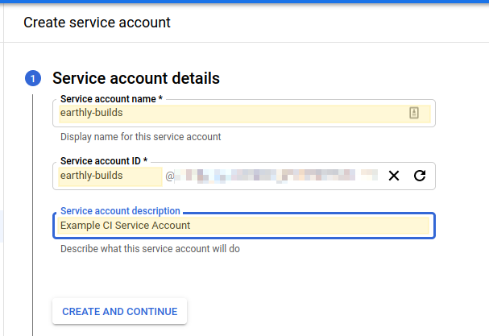
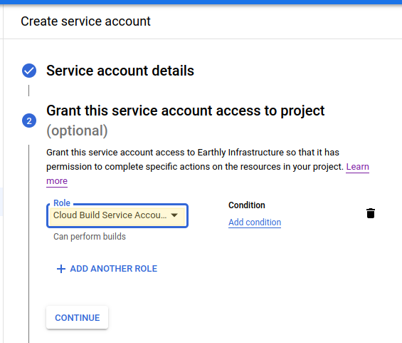
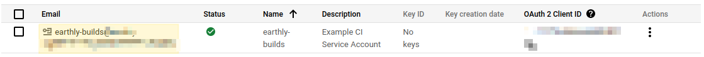
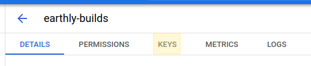
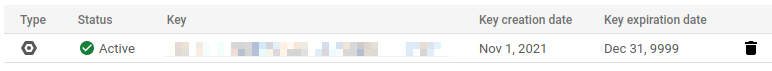
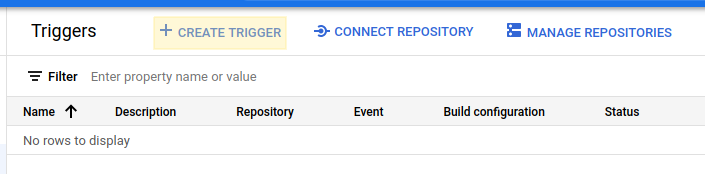
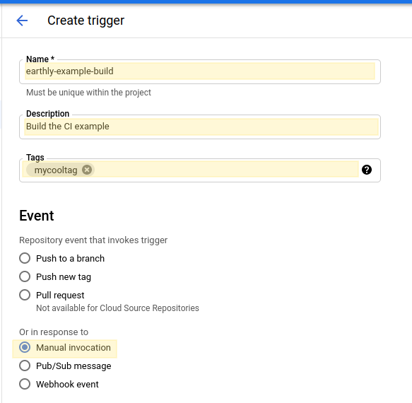
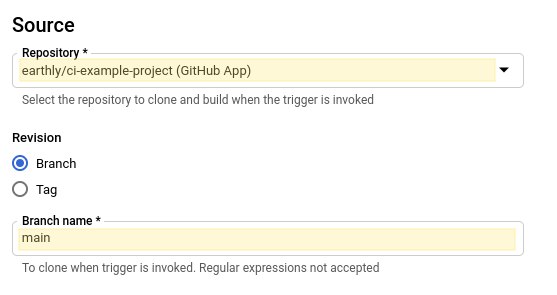
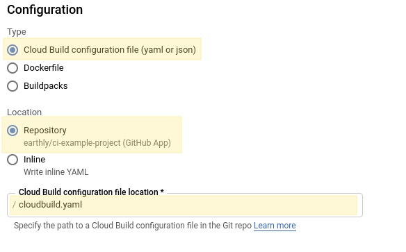
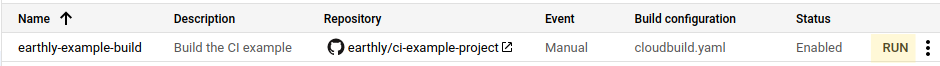

# Guide Template

## Overview

Google's Cloud Build is a popular, hosted build platform with deep integrations into the Google Cloud ecosystem. It includes native support for containerized builds, as well as other build scenarios. This guide will cover the use of Earthly within the `cloudbuild.yaml` spec (though it should be easily ported over to the `json` format if desired).

### Compatibility

Earthly itself is able to run as expected within Cloud Build, including privileged mode features like `WITH DOCKER`. However, Application Default Credentials are not available, so any `gcloud` or `gsutil` commands within your `Earthfile` will require additional manual configuration via a service account.

### Resources

 * [Getting Started With Cloud Build](https://cloud.google.com/build/docs/quickstart-build)
 * [Authenticating As A Service Account](https://cloud.google.com/docs/authentication/production)
 * [`cloudbuild.yaml` Specification](https://cloud.google.com/build/docs/build-config-file-schema)
 * [Creating and Managing build triggers](https://cloud.google.com/build/docs/automating-builds/create-manage-triggers)

## Setup

Depending on your needs and existing infrastructure, there may be additional configuration needed in your Google Cloud environment.

### Dependencies

Ensure that your repositories are connected to Cloud Build. [Google has a fantastic walkthrough for this](https://cloud.google.com/build/docs/automating-builds/create-manage-triggers#connect_repo).

### Configuration


##### Note

If you do not intend to use any Google Cloud utilities or capabilities within your build, this service account configuration is optional.



Begin by following [Google's instructions to create a service account](https://cloud.google.com/docs/authentication/production#create_service_account). These instructions are partially duplicated below, with some screenshots for completeness.

Start by creating a build service account. Go to the "Create service account" page in the "IAM & Admin" API section, choose the appropriate project, and fill out the step 1 "Service account details". When you are done, click "Create and Continue".



The creation steps should now ask you for a role to use in your build. The needs for each build are different; so examine your needs, and take care to grant the least privilege needed for your build. One reasonable starting point might be the [default Cloud Build service account permissions](https://cloud.google.com/build/docs/cloud-build-service-account#default_permissions_of_service_account).



Click "Done". The console should navigate you to a list of service accounts within the project. At this point, the account should be created, but we still need to create an account key. To do this, click on the email address for this service account in the list.



Then select "Keys" from the top navigation.



Click "Add Key", and then "Create New Key". Choose "JSON" as the key format, and click create. This will download the key to your computer, and you should see it in the list of keys.



Stash the key in your secret management utility of choice. You'll need to make this key available to your build at runtime. For the rest of our example, we will be using Earthly's [Cloud Secrets](../../cloud/cloud-secrets.md).

Often, external secrets management requires some kind of bootstrapping secret (or additional integration) to allow you to access the rest of the secrets in your store. Earthly is no different. We will keep our `EARTHLY_TOKEN` in [Googles Secret Manager](https://cloud.google.com/build/docs/securing-builds/use-secrets) for ease of use.


##### Note

It is also possible to perform these steps via the CLI; the steps are [also detailed in Googles instructions](https://cloud.google.com/docs/authentication/production#command-line). It can also be automated using much of the same steps.



## Additional Notes

`earthly` misinterprets the Cloud Build environment as a terminal. To hide the ANSI color codes, set `NO_COLOR` to `1`.

## Example


##### Note

This example is not production ready, and is intended to showcase configuration needed to get Earthly off the ground. If you run into any issues, or need help, [don't hesitate to reach out](https://github.com/earthly/earthly/issues/new)!



You can find our [`cloudbuild.yaml`](https://github.com/earthly/ci-example-project/blob/main/cloudbuild.yaml) and the [`Earthfile`](https://github.com/earthly/ci-example-project/blob/main/Earthfile) used on GitHub.

Start by adding a new [Trigger](https://console.cloud.google.com/cloud-build/triggers). Triggers are the things that link changes in your source code with new instances of builds in Cloud Build. Start by clicking on "Create Trigger".



Fill out the "Name", "Description", and "Event" sections for this trigger, as they make sense for your project. For our example (and for ease of testing) we will be using the "Manual Invocation" trigger here.



Configure your source repository. If you do not see your desired repository in the drop down list, follow [Google's instructions to add it](https://cloud.google.com/build/docs/automating-builds/create-manage-triggers#connect_repo).



Finally, fill in the "Configuration" section. For Earthly, you can only use the "Cloud Build configuration file", as Earthly itself will _also_ be running containers. Our example will also be using an embedded [`cloudbuild.yaml`](https://github.com/earthly/ci-example-project/blob/main/cloudbuild.yaml).



Click "Done" and you will be navigated back to the Triggers list view. To test the build, click "Run" since we chose a manual trigger only:



Running this build will use the [`cloudbuild.yaml`](https://github.com/earthly/ci-example-project/blob/main/cloudbuild.yaml) file in our sample repository. This file is also a key part of the build, so lets break this down as well.

[The first step](https://github.com/earthly/ci-example-project/blob/ea44992b020b52cb5a46920d5d11d4b8389ce19d/cloudbuild.yaml#L2-L6) simply uses the [all-in-one Earthly image](https://hub.docker.com/r/earthly/earthly) to do a simple build.

```yaml
  - id: 'build'
    name: 'earthly/earthly:v0.8.9'
    args:
      - --ci
      - --push
      - +build
```

[The second step](https://github.com/earthly/ci-example-project/blob/ea44992b020b52cb5a46920d5d11d4b8389ce19d/cloudbuild.yaml#L8-L13) runs a sample, Google Cloud Build only example to show how you would use an external service account to do things that normally requires credentials.

```yaml
  - id: 'gcp-test'
    name: 'earthly/earthly:v0.8.9'
    args:
      - +gcp-cloudbuild
    secretEnv:
      - 'EARTHLY_TOKEN'
```

The secret environment variable bootstraps the Earthly secret store, and we can load it from Google's Secret Store like this:

```yaml
availableSecrets:
  secretManager:
  - versionName: projects/earthly-jupyterlab/secrets/EARTHLY_TOKEN/versions/2
    env: 'EARTHLY_TOKEN'
```
