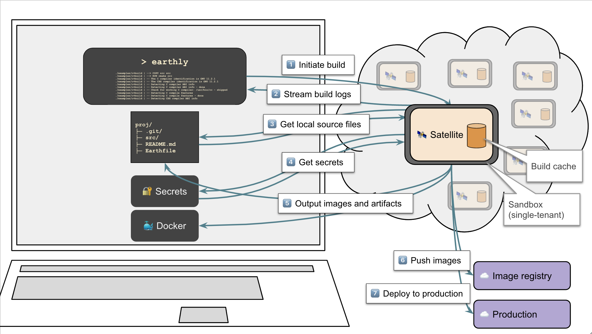

# Earthly Satellites

This feature is part of the Earthly Satellites & Earthly CI paid plans.


##### Important

This feature is currently in **Beta** stage

* The feature may break or change significantly in future versions of Earthly.
* Give us feedback on
  * [Slack](https://earthly.dev/slack)
  * [GitHub issues](https://github.com/earthly/cloud-issues/issues)
  * [Emailing support](mailto:support+satellite@earthly.dev)


Earthly Satellites are [remote runner](../remote-runners.md) instances managed by the Earthly team. They allow you to perform builds in the cloud, while retaining cache between runs.

When using Earthly Satellites, even though the build executes remotely, the following pieces of functionality are still available:

* Build logs are streamed to your local machine in real-time, just as if you were running the build locally
* Outputs (images and artifacts) resulting from the build, if any, are transferred back to your local machine
* Commands under `LOCALLY` execute on your local machine
* Secrets available locally, including Docker/Podman credentials are passed to the satellite whenever needed by the build
* Any images to be pushed are pushed directly from the satellite, using any Docker/Podman credentials available on the local system.



Earthly Satellite instances come with their own cache volume. This means that performing builds repeatedly on the same satellite will result in faster builds. This can be especially useful when using Satellites from a sandboxed CI environment, where cache from previous builds would not otherwise be available. Below is a comparison with Earthly's [Shared remote cache features](../remote-caching.md).

| Cache characteristic | Satellite | Shared Cache |
| --- | --- | --- |
| Storage location | Satellite | A container registry of your choice |
| Proximity to compute | ✅ Same machine | ❌ Performing upload/download is required |
| Just works, no configuration necessary | ✅ Yes | ❌ Requires experimentation with the various settings |
| Concurrent access | ✅ Yes | 🟡 Concurrent read access only |
| Retains entire cache of the build | ✅ Yes | ❌ Usually no, due to prohibitive upload time |
| Retains cache for multiple historical builds | ✅ Yes | ❌ No, only one build retained |
| Cache mounts (`RUN --mount type=cache` and `CACHE`) included | ✅ Yes | ❌ No |

## Benefits

Typical use cases for Earthly Satellites include:

* Speeding up CI builds in sandboxed CI environments such as GitHub Actions, GitLab, CircleCI, and others. Most CI build times are improved by a factor of 2-20X via Satellites.
* Executing builds on AMD64/Intel architecture natively when working from an Apple Silicon machine (Apple M1/M2).
* Sharing compute and cache with coworkers or with the CI.
* Benefiting from high-bandwidth internet access from the satellite, thus allowing for fast downloads of dependencies and fast pushes for deployments. This is particularly useful if operating from a location with slow internet.
* Using Earthly in environments where privileged access or docker-in-docker are not supported.

## Security

As builds often handle sensitive pieces of data, Satellites are designed with security in mind. Here are some of Earthly's security considerations:

* Satellite instances run in isolated VMs, with restricted local networking, and are only accessible by users you invite onto the platform.
* Network communication and data at rest is secured using industry state of the art practices.
* The cache is not shared between satellites.
* Secrets used as part of the build are only kept in-memory temporarily, unless they are part of the [Earthly Cloud Secrets storage](./cloud-secrets.md), in which case they are encrypted at rest.
* In addition, Earthly is pursuing SOC 2 compliance. SOC 2 Type I ETA Fall 2022, SOC 2 Type II ETA Summer 2023.
* To read more about Earthly's security practices please see the [Security page](https://earthly.dev/security).

## Getting started

### 1. Register an account and create an org

Follow the steps in the [Earthly Cloud overview](./overview.md#getting-started) to register an account and create an org.

### 2. Purchase a Satellites Plan

Satellites are a paid feature which require a subscription to begin using. The subscription includes a 14-day free trial which can be canceled before any payment is made. Visit the [pricing page](https://earthly.dev/pricing) for more billing details.

You can start your free trial by using the checkout form below. Be sure to provide the name of your Earthly org from Step 1.

[**Click here to start your subscription**](https://buy.stripe.com/8wM9Es4BT4Vvb4YbIJ)

Once you've submitted your details on the checkout page, you will receive an automated confirmation email.
The Earthly team will send you another follow-up shortly after once the satellites feature has active on your account.

### 3. Ensure that you have the latest version of Earthly

Because this feature is under heavy development right now, it is very important that you use the latest version of Earthly available.

**On Linux**, simply repeat the [installation steps](https://earthly.dev/get-earthly) to upgrade.

**On Mac**, you can perform:

```bash
brew update
brew upgrade earthly/earthly/earthly
```

### 4. Launch a new satellite

To launch a new satellite, run:

```bash
earthly sat launch <satellite-name>
```

The Satellite name can be any arbitrary string.

If you are part of multiple Earthly organizations, you may have to specify the org name under which you would like to launch the satellite:

```bash
earthly sat --org <org-name> launch <satellite-name>
```

Once the satellite is created it will be automatically selected for use as part of your builds. The selection takes place by Earthly adding some information in your Earthly config file (usually located under `~/.earthly/config.yml`).

### 5. Run a build

To execute a build using the newly created satellite, simply run Earthly like you always have. For example:

```bash
earthly +my-target
```

Because the satellite has been automatically selected in the step above, the build will be executed on it.

To go back to using your local machine for builds, you may "unselect" the satellite by running:

```bash
earthly sat unselect
```

You can always go back to using the satellite by running:

```bash
earthly sat select <satellite-name>
```

Or, you can use a satellite only for a specific build, even if it is not selected:

```bash
earthly --sat <satellite-name> +my-target
```

Conversely, if a satellite is currently selected, but you want to execute a build on your local machine, you can use the `--no-sat` flag:

```bash
earthly --no-sat +my-target
```

For more information on using satellites, see the [Using satellites page](./satellites/using.md).

### 6. Invite your team

A final optional step is to invite your team to use the satellite. This can be done by running:

```bash
earthly --org <org-name> org invite <email>
```

Once a user has been invited, you can forward them a link to the page [Using Satellites](./satellites/using.md) for them to get started.

## Managing Satellites

For more information on managing satellites, see the [Managing Satellites page](./satellites/managing.md).

## Satellite specs

Satellites are currently only available in different sizes and architectures. Please see the [Pricing Page](https://earthly.dev/pricing) for more details.

## Using Satellites in CI

A key benefit of using satellites in a CI environment is that the cache is shared between runs. This results in significant speedups in CIs that would otherwise have to start from scratch each time.


##### Note

If a satellite is shared between multiple CI pipelines, it is possible that it becomes overloaded by too many parallel builds. For best performance, you can create a dedicated satellite for each CI pipeline.


To get started with using Earthly Satellites in CI, you can create a login token for access.

First, run

```bash
earthly account create-token <token-name>
```

to create your login token.

Copy and paste the value into an environment variable called `EARTHLY_TOKEN` in your CI environment.

Then as part of your CI script, just run

```bash
earthly sat select <satellite-name>
```

before running your Earthly targets.

## Known limitations

* The output phase (the phase in which a satellite outputs build results back to the local machine) is slower than it could be. To work around this issue, you can make use of the `--no-output` flag (assuming that local outputs are not needed). You can even use `--no-output` in conjunction with `--push`. We are working on ways in which local outputs can be synchronized more intelligently such that only a diff is transferred over the network.

If you run into any issues please let us know either via [Slack](https://earthly.dev/slack), [GitHub issues](https://github.com/earthly/cloud-issues/issues) or by [emailing support](mailto:support+satellite@earthly.dev).
