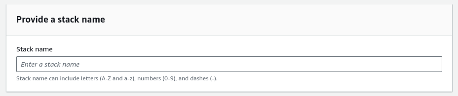
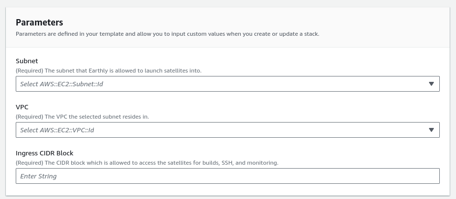
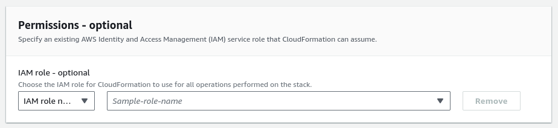
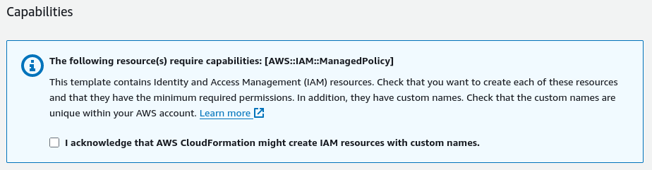

# Installing BYOC in AWS

This page documents the requirements and steps required to install BYOC Satellites in AWS.

## Requirements
Before you begin to provision your BYOC configuration within AWS, there are a few requirements you need to make sure you meet first:

### Networking
Because every configuration is different, using BYOC within your organization will require you to configure your networking to match your use case. You'll need to ensure that:

* Traffic from Earthly clients (build machines or otherwise) can reach the satellites directly. When installing the AWS CloudFormation template, a security group rule is created that should allow the correct ingress from the specified CIDR block.
* Traffic to any required resources (e.g. private repositories, the internet, etc) are allowed. When installing the AWS CloudFormation template, the default egress rule allows any outbound traffic.
* Internal AWS DNS names must resolve to an address reachable on the network. This is because invocations of Earthly that reference the BYOC satellite will use the AWS internal DNS address to try and reach the satellite. 

These can all be accomplished with most VPN technologies. We recommend and have direct experience with Tailscale. If you need help configuring other networking scenarios, please reach out to us!

### Cloud
Configuring BYOC in your AWS account is as simple as applying a CloudFormation template, and reading its outputs. You'll need:

* An account with permissions to create a new CloudFormation stack in AWS.
* An account with permissions to describe an existing CloudFormation stack in AWS.
* A VPC, and chosen subnet that Earthly will place its satellites into. *Take note of the CIDR block, you will need it later.*

Right now, BYOC is only supported in the `us-west-2` (Oregon) region.

### On Your Machine
After installing the CloudFormation template, you'll need to finish the installation at the command line. To do this, you'll need to ensure that:

* Earthly is installed.
* You have [AWS Credentials configured](https://docs.aws.amazon.com/cli/v1/userguide/cli-configure-files.html) with permissions to describe the CloudFormation stack you created.

## Installing the BYOC CloudFormation Template

You can install our CloudFormation Template, by opening on this link in a new tab and following the prompts:

If you need help, please reference the overview below:

### Template Overview

#### Stack Name

A "Stack" is a logical grouping of resources, created by a template using AWS CloudFormation. This name is required by AWS to identify the Stack we will create within CloudFormation.

Earthly will reuse this name as the name of the "installation" within Earthly, so you will always have a direct correlation between items in AWS and Earthly. This is also the string you will provide to the Earthly CLI during step 2.

#### Parameters

There are only a few parameters required to get up and moving with a BYOC setup, and they're mostly related to your networking configuration.

| Parameter          | Description                                                                                                                                                                                                                    |
|--------------------|--------------------------------------------------------------------------------------------------------------------------------------------------------------------------------------------------------------------------------|
| Subnet             | The location that Earthly will launch your satellites into. It can be as big or small as you would like, just make sure it has enough room to handle the expected number of Satellites.                                        |
| VPC                | The VPC for the subnet you selected earlier. The template should do some validation to ensure these match. While it might feel redundant, this parameter is here to avoid creating a more complicated CloudFormation template. |
| Ingress CIDR Block | This value will be used to create the needed security group rules for the Satellites that Earthly launches on your behalf. For instance, when using Tailscale, this could be the IP address of your Subnet Router.             |

All parameters with "(Required)" in the label subtext are required for a successful installation.

#### Permissions

This box is optional, and depends on your current permissions within AWS. In most cases, you can leave this blank.

If you try to install the template and get permissions errors, you can [contact us](https://earthly.dev/slack) or your AWS administrator for further guidance based on your specific situation.

#### Capabilities

The CloudFormation template will install two IAM policies within the account. One is to allow Earthly the permissions it needs to access your account and manage your satellite instances, and the other allows Satellites themselves to log to CloudWatch Logs. These have derived names that are associated with the Stack Name specified. Check the box to move on.

If organizational policy prevents you from creating IAM resources with custom names, you can create the needed resources manually, and use the [import functionality within CloudFormation](https://docs.aws.amazon.com/AWSCloudFormation/latest/UserGuide/resource-import.html) to install this stack.
