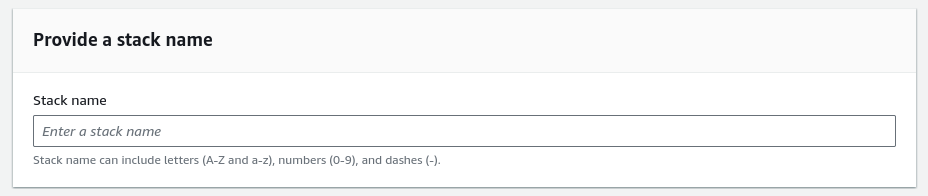
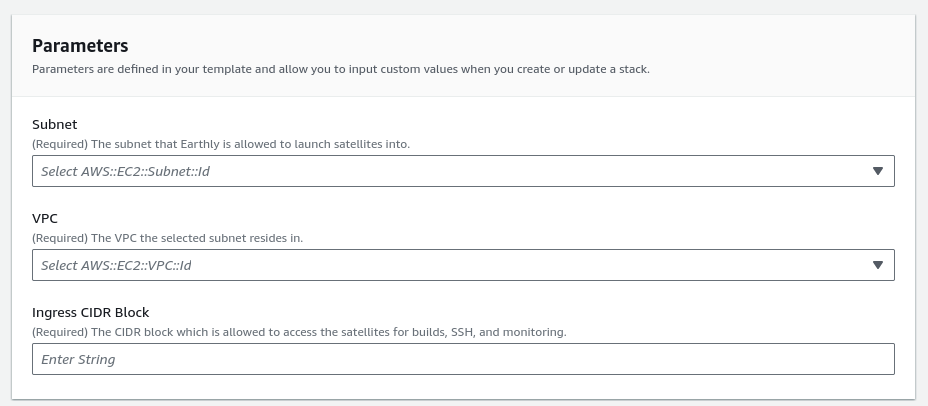
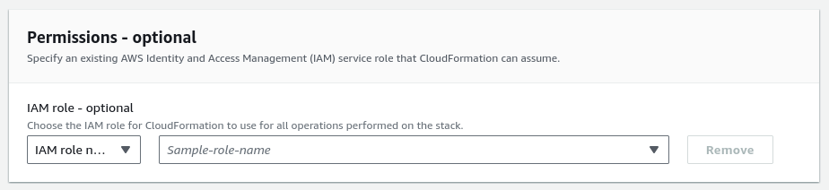
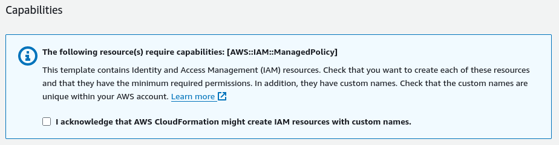
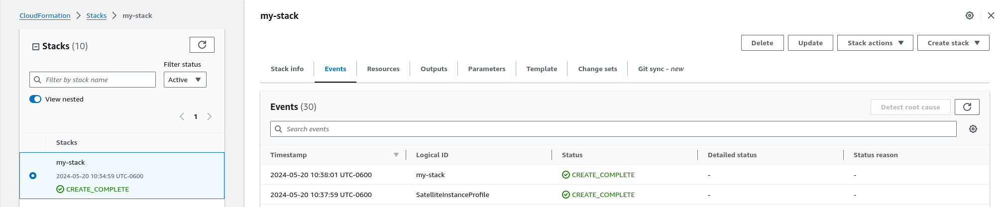
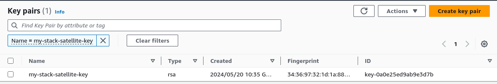
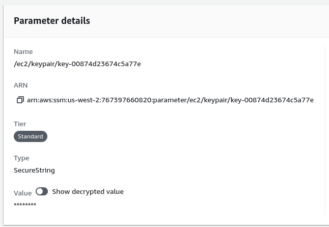

# Installing BYOC in AWS via Cloudformation

This page documents the requirements and steps required to install [BYOC Satellites](../byoc.md) in AWS using Earthly's CloudFormation template.

## Requirements
Before you begin to provision your BYOC configuration, ensure that you meet the [base requirements](./requirements.md) for installation within AWS.

There are also a few additional requirements you will need to make sure you meet:

* An AWS account or role with permissions to:
  * create a new CloudFormation stack, and
  * describe the newly created CloudFormation stack after it has run.
* An AWS account or role that can create all the resources specified in the template.
* You have [AWS Credentials configured](https://docs.aws.amazon.com/cli/v1/userguide/cli-configure-files.html) on your machine, with permissions to describe the CloudFormation stack you created.

## Installing the CloudFormation Template

You can install our CloudFormation template by opening this link in a new tab and following the prompts:

[](https://console.aws.amazon.com/cloudformation/home?region=us-west-2#/stacks/create/review?templateURL=https://production-byoc-installation.s3.us-west-2.amazonaws.com/cloudformation-byoc-installation.yaml)

If you need help, please reference the overview below:

### Template Overview

#### Stack Name


A "Stack" is a logical grouping of resources, created by a template using AWS CloudFormation. This name is required by AWS to identify the Stack we will create within CloudFormation.

Earthly will reuse this name as the name of the "installation" within Earthly, so you will always have a direct correlation between items in AWS and Earthly. This is also the string you will provide to the Earthly CLI during step 2.

#### Parameters

```
There are only a few parameters required to get up and moving with a BYOC setup, and they're mostly related to your networking configuration.

| Parameter          | Description                                                                                                                                                                                                                    |
|--------------------|--------------------------------------------------------------------------------------------------------------------------------------------------------------------------------------------------------------------------------|
| Subnet             | The location that Earthly will launch your satellites into. It can be as big or small as you would like, just make sure it has enough room to handle the expected number of Satellites.                                        |
| VPC                | The VPC for the subnet you selected earlier. The template should do some validation to ensure these match. While it might feel redundant, this parameter is here to avoid creating a more complicated CloudFormation template. |
| Ingress CIDR Block | This value will be used to create the needed security group rules for the Satellites that Earthly launches on your behalf. For instance, when using Tailscale, this could be the IP address of your Subnet Router.             |

All parameters with "(Required)" in the label subtext are required for a successful installation.

#### Permissions


This box is optional, and depends on your current permissions within AWS. In most cases, you can leave this blank.

If you try to install the template and get permissions errors, you can [contact us](https://earthly.dev/slack) or your AWS administrator for further guidance based on your specific situation.

#### Capabilities


The CloudFormation template will install two IAM policies within the account. One is to allow Earthly the permissions it needs to access your account and manage your satellite instances, and the other allows Satellites themselves to log to CloudWatch Logs. These have derived names that are associated with the Stack Name specified. Check the box to move on.

If organizational policy prevents you from creating IAM resources with custom names, you can create the needed resources manually, and use the [import functionality within CloudFormation](https://docs.aws.amazon.com/AWSCloudFormation/latest/UserGuide/resource-import.html) to install this stack.

#### Finalize

If all this looks good, click the "Next" button at the bottom of the page. Your stack will start creating. Click the refresh button in the top right to update the list of events. Proceed with the rest of the BYOC installation once the stack creation is `CREATE_COMPLETE`.



### Post-Installation Notes

#### SSH
The template creates an SSH key that can be used to access the Satellites for debugging, or other diagnostic purposes. While the fingerprint and public key are stored in the usual spot within EC2, the private key can take a little bit of digging. Here's how to find it:
* Get the id of the key created by CloudFormation:
  * Open EC2, and click on "Key Pairs", under the "Network & Security" section on the left. 
  * Find the key named `<stack-name>-satellite-key`, where `<stack-name>` is the name you used when creating the CloudFormation Stack.
  * Note the id column for this entry, and use it in the next step.
    
* Visit the [SSM Parameter Store](https://us-west-2.console.aws.amazon.com/systems-manager/parameters?region=us-west-2)
  * Click on the name of the desired secret, it will be of the format `/ec2/keypair/<key-id>`, where `<key-id>` is the id you got from EC2.
  * On the "Overview" tab, in the "Parameter details" box, there is a toggle labeled "Show decrypted value". Click it to reveal your SSH private key:
    

If you prefer the CLI:
* Run this to get the ID of your key:
  ```shell
  aws ec2 describe-key-pairs \
    --filters 'Name=key-name,Values=<stack-name>-satellite-key' \
    --query 'KeyPairs[*].KeyPairId' \
    --output text
  ```
  Where `<stack-name>` is the name you gave the CloudFormation stack at creation time.
* Next, run this to get your key, and save it in a file named `key.pem`:
  ```shell
  aws ssm get-parameter \
  --name /ec2/keypair/<key-id> \
  --with-decryption \
  --query Parameter.Value \
  --output text > key.pem
  ```
  Where `<key-id>` is the value obtained from the prior step.

#### Customization
If you need/want to make changes to your installation, please see AWS' guide for [resolving drift in a CloudFormation stack via import](https://docs.aws.amazon.com/AWSCloudFormation/latest/UserGuide/resource-import-resolve-drift.html).
