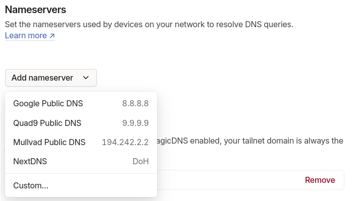
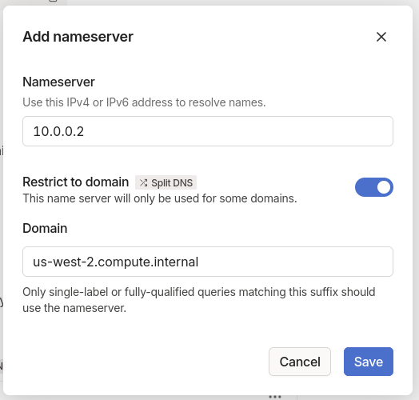

# Configuring Tailscale for BYOC

Tailscale is a super-simple VPN that is easy to set up, and works well with BYOC satellites. This page documents the required configuration within Tailscale to enable BYOC.

## Requirements

* Configure a [subnet router](https://tailscale.com/kb/1019/subnets) to provide access to satellites for users on the VPN. This is required because satellites never join a VPN directly, and may change IP/DNS addresses frequently.
* [Configure Restricted Nameservers (Split DNS)](https://tailscale.com/kb/1054/dns?q=split+dns#nameservers) to resolve custom DNS names, as required by your cloud provider.
* If you are running Earthly from within a Kubernetes pod, or GHA runner; you may need to make use of the [userspace networking mode](https://tailscale.com/kb/1112/userspace-networking).
  * When using userspace networking, you need to add a Global nameserver to your DNS settings.

Because network configuration can vary wildly across organizations and cloud providers, we've provided some further general guidance below.

### AWS

* [Step-by-step instructions to configure a subnet router in AWS](https://tailscale.com/kb/1021/install-aws)
  * If you have multiple cloud installations sharing a single subnet, the single subnet router can be shared.
* It is required to add a Split DNS entry for the `<aws-region>.compute.internal` TLD, because Earthly uses the AWS internal DNS addresses to resolve satellites. To do this:
  * Open the [DNS page in your Tailscale admin panel](https://login.tailscale.com/admin/dns), find the "Nameservers" section, and click on "Add Nameserver" -> "Custom".
  
  * In the modal that appears, use:
    * `x.x.0.2` as the nameserver address, where `x` is corresponds to the CIDR block allocated to your VPC.
    * Check the box for "Restrict to domain" to enable Split DNS.
    * Add `<aws-region>.compute.internal` as the Domain, where `<aws-region>` corresponds to the region the subnet router is installed in. This option appears once the "Restrict to domain" option is toggled.
  
