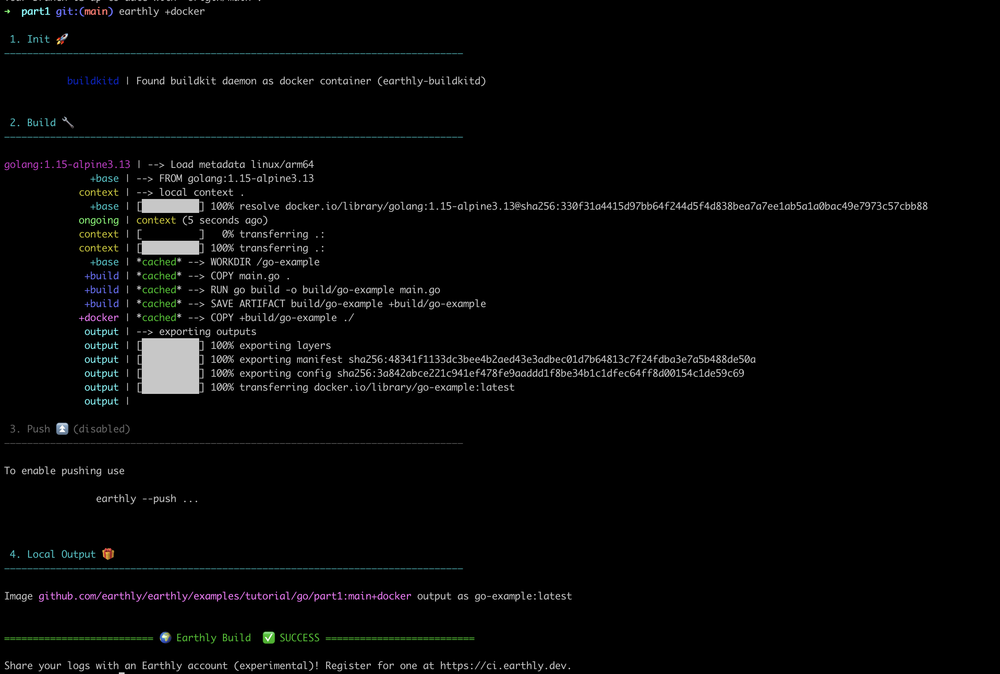

# Basics

You're here to learn how to use Earthly. Welcome! Earthly is a build system based upon modern development technologies available today, like Docker.

First, a few concepts:

* Earthly - the build system as a whole
* `earth` - the CLI tool used to interact with Earthly
* earthfile - a file named `build.earth`, which contains a series of targets and their respective recipes
* buildkitd - a [daemon built by the Docker team](https://github.com/moby/buildkit) and used by Earthly to execute builds. It executes LLB, the same low-level primitives used when building Dockerfiles. The buildkitd daemon is started automatically in a docker container, by `earth`, when executing builds.
* recipe - a specific series of build steps
* target - the label used to identify a recipe. 'Target' is also used to refer to a build of a specific target.
* build context - the main directory made available to the build for copying files from
* artifact - a file resulting from executing a target (not all targets have artifacts)
* image - a docker image resulting from executing a target (not all targets have images)

Now that we got that out of the way, we can now be more specific:

Earthly is a build system where all recipes are executed in docker containers, with layer caching principles similar to Dockerfiles, and where the only thing shared between recipes are declared artifacts and images.

A key difference from a Dockerfile build is that Earthly can be used to build not just images, but also artifacts - regular files or directories that can be written back onto the host filesystem.

## A simple Earthfile

Earthfiles are always named `build.earth`, regardless of their location in the codebase.



Here is a sample earthfile of a Go app

```Dockerfile
# build.earth

FROM golang:1.13-alpine3.11
WORKDIR /go-example

build:
    COPY main.go .
    RUN go build -o build/go-example main.go
    SAVE ARTIFACT build/go-example /go-example AS LOCAL build/go-example

docker:
    COPY +build/go-example .
    ENTRYPOINT ["/go-example/go-example"]
    SAVE IMAGE go-example:latest
```

The code of the app might look like this

```go
// main.go

package main

import "fmt"

func main() {
	fmt.Println("hello world")
}
```


Here is a sample earthfile of a JS app

```Dockerfile
# build.earth

FROM node:13.10.1-alpine3.11
WORKDIR /js-example

build:
    # In JS, there's nothing to build in this simple form.
    # The source is also the artifact used in production.
    COPY index.js .
    SAVE ARTIFACT index.js /dist/index.js AS LOCAL /dist/index.js

docker:
    COPY +build/dist /dist
    ENTRYPOINT ["node", "./dist/index.js"]
    SAVE IMAGE js-example:latest
```

The code of the app might look like this

```js
// index.js

console.log("hello world");
```


Here is a sample earthfile of a Java app

```Dockerfile
# build.earth

FROM openjdk:8-jdk-alpine
RUN apk add --update --no-cache gradle
WORKDIR /java-example

build:
    COPY src src
    RUN gradle build
    RUN gradle install
    SAVE ARTIFACT build/install/java-example/bin /bin AS LOCAL build/bin
    SAVE ARTIFACT build/install/java-example/lib /lib AS LOCAL build/lib

docker:
    COPY +build/bin bin
    COPY +build/lib lib
    ENTRYPOINT ["/java-example/bin/java-example"]
    SAVE IMAGE java-example:latest
```

The code of the app might look like this

```java
// src/main/java/hello/HelloWorld.java

package hello;

public class HelloWorld {
    public static void main(String[] args) {
        System.out.println("hello world");
    }
}
```


You will notice that the recipes look very much like Dockerfiles. This is an intentional design decision. Existing Dockerfiles can be ported to earthfiles by copy-pasting them over and then tweaking them slightly. Compared to Dockerfile syntax, some commands are new (like `SAVE ARTIFACT`), others have additional semantics (like `COPY +target/some-artifact`) and other semantics are removed (like `FROM ... AS ...` and `COPY --from`).

All earthfiles start with a base recipe. This is the only recipe which does not have an explicit target name - the name is always implied to be `base`. All other target implicitly inherit from `base`. You can imagine that all recipes start with an implicit `FROM +base`.

In this particular example, we can see two explicit targets: `build` and `docker`. In order to execute the build, we can run, for example:

```bash
earth +build
```

or

```bash
earth +docker
```

The output might look like this:



Notice how to the left of `|`, within the output, we can see some targets like `+base`, `+build` and `+docker` . Notice how the output is interleaved between `+docker` and `+build`. This is because the system executes independent build steps in parallel. The reason this is possible effortlessly is because only very few things are shared between the builds of the recipes and those things are declared and obvious. The rest is completely isolated.

In addition, notice how even though the base is used as part of both `build` and `docker`, it is only executed once. This is because the system deduplicates execution, where possible.

Furthermore, the fact that the `docker` target depends on the `build` target is visible within the command `COPY +build/...`. Through this command, the system knows that it also needs to build the target `+build`, in order to satisfy the dependency on the artifact.

Finally, notice how the output of the build: the docker image `go-example:latest` and the file `build/go-example` is only written after the build is declared a success. This is due to another isolation principle of Earthly: a build either succeeds completely or it fails altogether.


##### Note

Targets have a particular referencing convention which helps Earthly to identify which recipe to execute. In the simplest form, targets are referenced by `+<target-name>` - for example, `+build`. For more details see the [target referencing page](./target-ref.md).


## Detailed explanation

Going back to the example earthfile definition, here is what each command does:



```Dockerfile
# build.earth

# The build starts from a docker image: golang:1.13-alpine3.11
FROM golang:1.13-alpine3.11
# We change the current working directory.
WORKDIR /go-example

# The above commands are inherited implicitly by all targets below
# (as if they started with FROM +base).

# Declare a target, build.
build:
    # Define the recipe of the target build as follows:

    # Copy main.go from the build context to the build environment, as a layer.
    COPY main.go .
    # Run a go build command as a layer.
    # This uses the previously copied main.go file.
    RUN go build -o build/go-example main.go
    # Save the output of the build command as an artifact. Call this
    # artifact /go-example (it can be later referenced as +build/go-example).
    # In addition, store the artifact as a local file (on the host) named
    # build/go-example. This local file is only written if the entire build
    # succeeds.
    SAVE ARTIFACT build/go-example /go-example AS LOCAL build/go-example

# Declare a target, docker.
docker:
    # Define the recipe of the target docker as follows:

    # Copy the artifact /go-example produced by another target, +build, to the
    # current directory within the build container.
    COPY +build/go-example .
    # Set the entrypoint for the resulting docker image.
    ENTRYPOINT ["/go-example/go-example"]
    # Save the current state as a docker image, which will have the docker tag
    # go-example:latest. This image is only made available to the host's docker
    # if the entire build succeeds.
    SAVE IMAGE go-example:latest
```

```Dockerfile
# build.earth

# The build starts from a docker image: node:13.10.1-alpine3.11
FROM node:13.10.1-alpine3.11
# We change the current working directory.
WORKDIR /js-example

# The above commands are inherited implicitly by all targets below
# (as if they started with FROM +base).

# Declare a target, build.
build:
    # Define the recipe of the target build as follows:

    # Copy index.js from the build context to the build environment, as a layer.
    COPY index.js .
    # Save the index.js in an artifact dir called dist (it can be later
    # referenced as +build/dist). In addition, store the artifact as a
    # local file (on the host) named dist/index.js. This local file is only
    # written if the entire build succeeds.
    SAVE ARTIFACT index.js /dist/index.js AS LOCAL /dist/index.js

# Declare a target, docker.
docker:
    # Define the recipe of the target docker as follows:

    # Copy the artifact /dist produced by another target, +build, to the
    # current directory within the build container.
    COPY +build/dist /dist
    # Set the entrypoint for the resulting docker image.
    ENTRYPOINT ["node", "./dist/index.js"]
    # Save the current state as a docker image, which will have the docker tag
    # js-example:latest. This image is only made available to the host's docker
    # if the entire build succeeds.
    SAVE IMAGE js-example:latest
```

```Dockerfile
# build.earth

# The build starts from a docker image: openjdk:8-jdk-alpine
FROM openjdk:8-jdk-alpine
# We install gradle using alpine's apk command.
RUN apk add --update --no-cache gradle
# We change the current working directory.
WORKDIR /java-example

# The above commands are inherited implicitly by all targets below
# (as if they started with FROM +base).

# Declare a target, build.
build:
    # Define the recipe of the target build as follows:

    # Copy src from the build context to the build environment, as a layer.
    COPY src src
    # Run the gradle build and gradle install commands as layers.
    # These use the previously copied src dir.
    RUN gradle build
    RUN gradle install
    # Save the output of the build command as artifacts. Call these
    # artifacts bin and lib (they can be later referenced as +build/bin and
    # +build/lib respectively).
    # In addition, store the artifacts as local dirs (on the host) named
    # build/bin and build/lib. This local dirs are only written if the entire
    # build succeeds.
    SAVE ARTIFACT build/install/java-example/bin /bin AS LOCAL build/bin
    SAVE ARTIFACT build/install/java-example/lib /lib AS LOCAL build/lib

# Declare a target, docker.
docker:
    # Define the recipe of the target docker as follows:

    # Copy the artifacts /bin and /lib produced by another target, +build, to
    # the current directory within the build container.
    COPY +build/bin bin
    COPY +build/lib lib
    # Set the entrypoint for the resulting docker image.
    ENTRYPOINT ["/java-example/bin/java-example"]
    # Save the current state as a docker image, which will have the docker tag
    # java-example:latest. This image is only made available to the host's
    # docker if the entire build succeeds.
    SAVE IMAGE java-example:latest
```


## Adding dependecies in the mix

...

## Efficient caching of dependencies

...

## Reduce repetition

...

## See also

* The [Earthfile reference](../earthfile/earthfile.md)
* The [earth command reference](../earth-command/earth-command.md)
* More [examples](../examples/examples.md)
