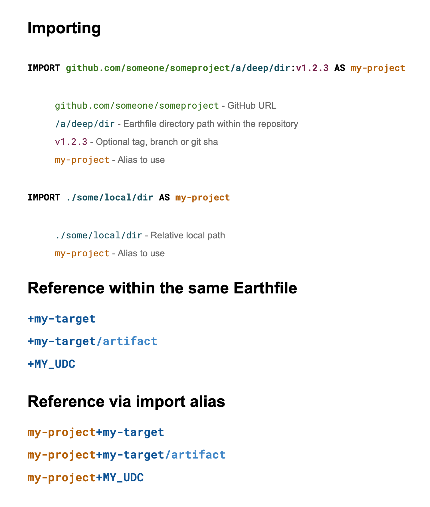

# Importing

Importing in Earthly is how multiple build components (targets, artifacts, functions, Earthfiles) can be interconnected to compose complex build setups while reusing build code. This page describes the syntax and semantics of importing in Earthly.

## Cheat sheet

Here's a quick cheat sheet for the syntax of importing in Earthly. The sections below go into more detail on each of these.



## Import basics

Let's start with a few simple examples.

### Importing within the same Earthfile

When importing a target from the same Earthfile, the import reference is simply the name of the target being imported, with a `+` in front. For example:

```Dockerfile
target1:
    RUN echo "Hello World"

target2:
    BUILD +target1
```

If you want to import an artifact, the import reference is the target reference, followed by a `/`, followed by the path to the artifact. For example:

```Dockerfile
target1:
    RUN echo "Hello World" > out.txt
    SAVE ARTIFACT out.txt

target2:
    COPY +my-target/out.txt ./
```

### Importing from other repositories

When importing from other repositories, making use of the `IMPORT` command helps to keep the Earthfile clean and readable. The `IMPORT` command takes an Earthfile reference, and optionally an import alias. For example:

```Dockerfile
IMPORT github.com/earthly/hello-world:main AS hello-world

...

my-target:
    BUILD hello-world+hello
    COPY hello-world+hello/hello.txt ./
```

In this example, the target `my-target` uses the import alias `hello-world` to reference a GitHub repository called `github.com/earthly/hello-world`, and the target `hello` within that repository. The `AS hello-world` part is optional, and is only needed if the import alias is different from the repository name.

`BUILD` is used to simply issue the build of the referenced target. Commands like `COPY` or `FROM` can be used to import artifacts or images, respectively.

### Importing from other directories

Importing from other directories is similar to importing from other repositories. The only difference is that the Earthfile reference is a relative path to the directory containing the Earthfile. For example:

```Dockerfile
IMPORT ./some/other/dir AS other-dir

my-target:
    BUILD other-dir+my-target
    COPY other-dir+my-target/out.txt ./
```

### Inline imports

Importing can also be done inline, without the need for an `IMPORT` command. This is useful for importing a single target or artifact from a remote repository. For example:

```Dockerfile
BUILD github.com/earthly/hello-world:main+hello
COPY ./some/other/dir+my-target/out.txt ./
```

## Referencing syntax

This subsection goes through the different types of references that Earthly uses:

* Earthfile references `github.com/foo/bar`, `./my/local/path`
* Target references: `<earthfile-ref>+my-target`
* Artifact references: `<earthfile-ref>+my-target/my-artifact.bin`
* Image references (same as target references)
* Function references: `<earthfile-ref>+MY_FUNCTION`

## Target reference

Target references point to an Earthly target. They have the general form

`<earthfile-ref>+<target>`

Target references distinguish themselves from function references (see below) by having a name in all-lower-case, kebab-case (e.g. `+my-target`).

Here are some examples:

* `+build`
* `./js+deps`
* `github.com/earthly/earthly:v0.8.13+earthly`
* `my-import+build`

## Artifact reference

Artifact references are similar to target references, except that they have an artifact path at the end. It has the following form

`<target-ref>/<artifact-path>`

Here are some examples:

* `+build/my-artifact`
* `+build/some/artifact/deep/in/a/dir`
* `./js+build/dist`
* `github.com/earthly/earthly:v0.8.13+earthly/earthly`
* `my-import+build/my-artifact`

## Image reference

Because there can only be one image per target, image references have the exact same format as target references.

The only difference is the context where they are used. For example, a `FROM` command takes an image reference. While a `BUILD` command takes a target reference.

## Function reference

Function references point to a [function](./functions.md) in an Earthfile. They have the general form

`<earthfile-ref>+<function>`

Function references distinguish themselves from target references by having a name in all-caps, snake-case (e.g. `+MY_FUNCTION`).

Here are some examples:

* `+COMPILE`
* `./js+NPM_INSTALL`
* `github.com/earthly/earthly:v0.8.13+DOWNLOAD_DIND`
* `my-import+COMPILE`

For more information on functions, see the [Functions Guide](./functions.md).

## Earthfile references

Earthfile references appear in target, artifact and function references. They point to the Earthfile containing the respective target, artifact or function. Below are the different types of Earthfile references available in Earthly.

### Local, internal

The simplest form, is where a target, function or artifact is referenced from the same Earthfile. In this case, the Earthfile reference is simply **the empty string**. Here are some examples of this type of Earthfile reference being used in various other references:

| Earthfile ref | Target ref | Artifact ref | Function ref |
|----|----|----|----|
| (**empty string**) | `+<target-name>` | `+<target-name>/<artifact-path>` | `+<function-name>` |
| (**empty string**) | `+build` | `+build/out.bin` | `+COMPILE` |

In this form, Earthly will look for the target within the same Earthfile. We call this type of referencing local, internal. Local, because it comes from the same system, and internal, because it is within the same Earthfile.

### Local, external

Another form, is where a target, function or artifact is referenced from a different directory. In this form, the path to that directory is specified before `+`. It must always start with either `./`, `../` or `/`, on any operating system (including Windows). Example:

| Earthfile ref | Target ref | Artifact ref | Function ref |
|----|----|----|----|
| `./path/to/another/dir` | `./path/to/another/dir+<target-name>` | `./path/to/another/dir+<target-name>/<artifact-path>` | `./path/to/another/dir+<function-name>` |
| `./js` | `./js+build` | `./js+build/out.bin` | `./js+COMPILE` |

It is recommended that relative paths are used, for portability reasons: the working directory checked out by different users will be different, making absolute paths infeasible in most cases.


##### Note
When using a `Target ref` in a `BUILD` command or an `Artifact ref` in a `COPY` command, the ref to the target
may also include a glob expression (e.g. `./parent/*+<target-name>`, `./parent/*+<target-name>/<artifact-path>`). Globbing in a target/artifact ref has experimental status. To use this feature, it must be enabled via `VERSION --wildcard-builds 0.8` (for `BUILD`) or `VERSION --wildcard-copy 0.8` (for `COPY`).


### Remote

Another form of a Earthfile reference is the remote form. In this form, the recipe and the build context are imported from a remote location. It has the following form:

| Earthfile ref | Target ref | Artifact ref | Function ref |
|----|----|----|----|
| `<vendor>/<namespace>/<project>/path/in/project[:some-tag]` | `<vendor>/<namespace>/<project>/path/in/project[:some-tag]+<target-name>` | `<vendor>/<namespace>/<project>/path/in/project[:some-tag]+<target-name>/<artifact-path>` | `<vendor>/<namespace>/<project>/path/in/project[:some-tag]+<function-name>` |
| `github.com/earthly/earthly/buildkitd` | `github.com/earthly/earthly/buildkitd+build` | `github.com/earthly/earthly/buildkitd+build/out.bin` | `github.com/earthly/earthly/buildkitd+COMPILE` |
| `github.com/earthly/earthly:v0.8.13` | `github.com/earthly/earthly:v0.8.13+build` | `github.com/earthly/earthly:v0.8.13+build/out.bin` | `github.com/earthly/earthly:v0.8.13+COMPILE` |

### Import reference

Finally, the last form of Earthfile referencing is an import reference. Import references may only exist after an `IMPORT` command, which helps resolve the reference to a full Earthfile reference of the types above.

| Import command | Earthfile ref | Target ref | Artifact ref | Function ref |
|----|----|----|----|----|
| `IMPORT <full-earthfile-ref> AS <import-alias>` | `<import-alias>` | `<import-alias>+<target-name>` | `<import-alias>+<target-name>/<artifact-path>` | `<import-alias>+<function-name>` |
| `IMPORT github.com/earthly/earthly/buildkitd` | `buildkitd` | `buildkitd+build` | `buildkitd+build/out.bin` | `buildkitd+COMPILE` |
| `IMPORT github.com/earthly/earthly:v0.8.13` | `earthly` | `earthly+build` | `earthly+build/out.bin` | `earthly+COMPILE` |

Here is an example in an Earthfile:

```Dockerfile
IMPORT github.com/earthly/earthly/buildkitd

...

BUILD buildkitd+buildkitd
```

## Implicit Base Target Reference

All Earthfiles start with a base recipe. This is the only recipe which does not have an explicit target name - the name is always implied to be `base`. All other target implicitly inherit from `base`. You can imagine that all recipes start with an implicit `FROM +base`

```
# base recipe
FROM golang:1.15-alpine3.13
WORKDIR /go-example

build:
    # implicit FROM +base
    RUN echo "Hello World"
```

## Canonical form

Most references have a canonical form. It is essentially the remote form of the same target, with repository and tag inferred. The canonical form can be useful as a universal identifier for a target.

For example, depending on where the files are stored, the `+build` target could have the canonical form `github.com/some-user/some-project/some/deep/dir:master+build`, where `github.com/some-user/some-project` was inferred as the Git location, based on the Git remote called `origin`, and `/some/deep/dir` was inferred as the sub-directory where `+build` exists within that repository. The Earthly tag is inferred using the following algorithm:

* If the current HEAD has at least one Git tag, then use the first Git tag listed by Git, otherwise
* If the repository is not in detached HEAD mode, use the current branch, otherwise
* Use the current Git hash.

If no Git context is detected by Earthly, then the target does not have a canonical form.
