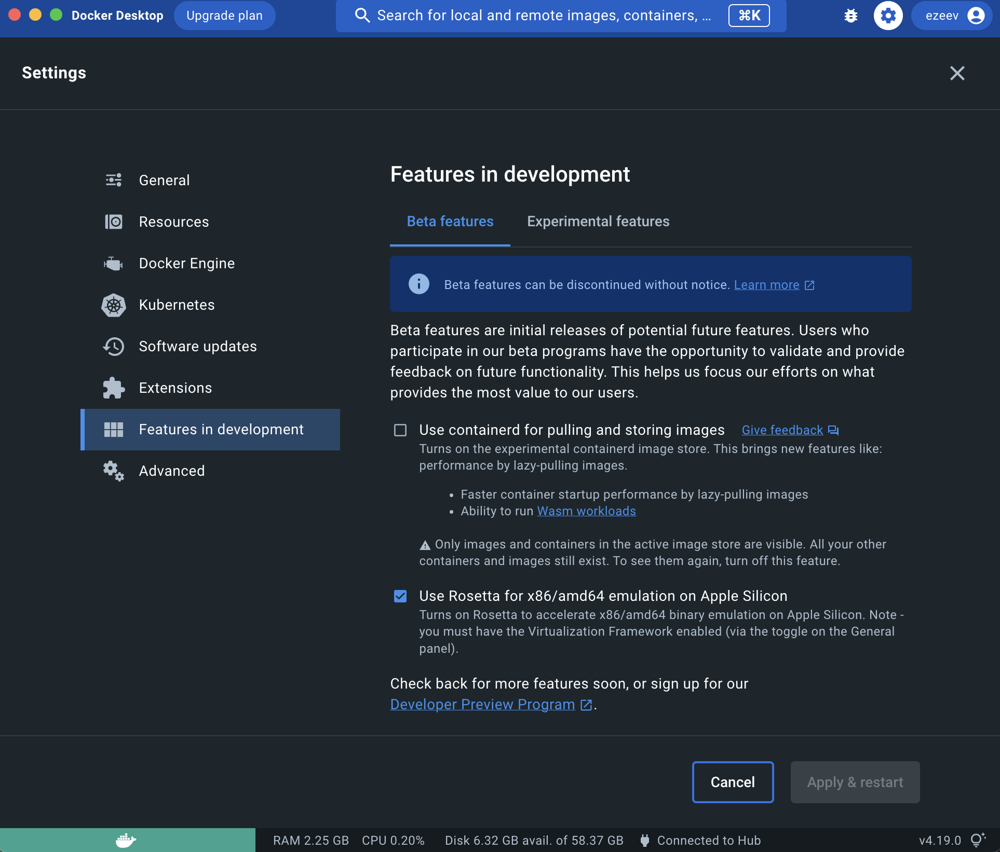

# Multi-platform builds

Earthly has the ability to perform builds for multiple platforms, in parallel. This page walks through setting up your system to support emulation as well as through a few simple examples of how to use this feature.

Currently only `linux` is supported as the build platform OS. Building with Windows containers will be available in a future version of Earthly.

By default, builds are performed on the same architecture as the runner's native architecture. Using the `--platform` flag across various Earthfile commands or as part of the `earthly` command, it is possible to override the build platform and thus be able to execute builds on non-native processor architectures. Execution of non-native binaries can be performed via QEMU emulation.

In some cases, execution of the build itself does not need to happen on the target architecture, through cross-compilation features of the compiler. Examples of languages that support cross-compilation are Go and Rust. This approach may be more beneficial in many cases, as there is no need to install QEMU and also, the build is more performant.

## Prerequisites for emulation

In order to execute emulated build steps (usually `RUN`), QEMU needs to be installed and set up. This will allow you to perform Earthly builds on non-native platforms, but also incidentally, to run Docker images on your host system through `docker run --platform=...`.

### Windows and Mac

On Mac and on Windows, the Docker Desktop app comes with QEMU readily installed and ready to go, so no special consideration is necessary.

### Apple Silicon (M1 & M2 processors)

Docker for Mac on M1 and M2-based systems uses Rosetta for x86/amd64 emulation. This is **not enabled** by default. To enable it, go to Docker Desktop, open Settings, then Features in Development, and check the box next to "Use Rosetta for x86/amd64 emulation". This will enable emulation for all x86/amd64 containers, including Earthly builds.



### Linux

On Linux, QEMU needs to be installed manually. On Ubuntu, this can be achieved by running:

```bash
sudo apt-get install qemu-system binfmt-support qemu-user-static
docker run --rm --privileged multiarch/qemu-user-static --reset -p yes
docker stop earthly-buildkitd || true
```

The `docker run` command above enables execution of different multi-architecture containers by QEMU and `binfmt_misc`. It only needs to be run once.

### GitHub Actions

To make use of emulation in GitHub Actions, the following step needs to be included in every job that performs a multi-platform build:

```yaml
jobs:
  <job-name>:
    steps:
      - name: Set up QEMU
        id: qemu
        uses: docker/setup-qemu-action@v1
        with:
          image: tonistiigi/binfmt:latest
          platforms: all
      - uses: actions/checkout@v3
      - ...
```

## Performing multi-platform builds

In order to execute builds for multiple platforms, the execution may be parallelized through the repeated use of the `BUILD --platform` flag. For example:

```Dockerfile
build-all-platforms:
    BUILD --platform=linux/amd64 --platform=linux/arm/v7 +build

build:
    ...
```

If the `+build` target were invoked without the use of any flag, Earthly would simply perform the build on the native architecture of the host system.

However, invoking the target `+build-all-platforms` causes `+build` to execute twice, in parallel: one time on `linux/amd64` and another time on `linux/arm/v7`.

You may also override the target platform when issuing the `earthly` build command. For example:

```bash
earthly --platform=linux/arm64 +build
```

This would cause the build to execute on the `linux/arm64` architecture.

## Saving multi-platform images

The easiest way to include platform information as part of a build is through the use of `FROM --platform`. For example:

```Dockerfile
FROM --platform=linux/arm/v7 alpine:3.18
```

If multiple targets create an image with the same name, but for different platforms, the images will be merged into a multi-platform image during export. For example:

```Dockerfile
build-all-platforms:
    BUILD +build-amd64
    BUILD +build-arm-v7

build-amd64:
    FROM --platform=linux/amd64 alpine:3.18
    ...
    SAVE IMAGE --push org/myimage:latest

build-arm-v7:
    FROM --platform=linux/arm/v7 alpine:3.18
    ...
    SAVE IMAGE --push org/myimage:latest
```

When `earthly --push +build-all-platforms` is executed, the build will push a multi-manifest image to the Docker registry. The manifest will contain two images: one for `linux/amd64` and one for `linux/arm/v7`. This works as such because both targets that save images use the exact same Docker tag for the image.

Of course, in some situations, the build steps are the same (except they run on different platform), so the two definitions can be merged like so:

```Dockerfile
build-all-platforms:
    BUILD --platform=linux/amd64 --platform=linux/arm/v7 +build

build:
    FROM alpine:3.18
    ...
    SAVE IMAGE --push org/myimage:latest
```

A more complete version of this example is available in [examples/multiplatform](https://github.com/earthly/earthly/tree/main/examples/multiplatform) in GitHub. You may try out this example without cloning by running

```bash
earthly github.com/earthly/earthly/examples/multiplatform:main+all
docker run --rm earthly/examples:multiplatform
docker run --rm earthly/examples:multiplatform_linux_amd64
docker run --rm earthly/examples:multiplatform_linux_arm_v7
```



##### Note

As of the time of writing this article, the `docker` CLI has limited support for working with multi-manifest images locally. For this reason, when exporting an image to the local Docker daemon, Earthly provides the different architectures as different Docker tags.

For example, the above build would yield locally:

- `org/myimage:latest`
- `org/myimage:latest_linux_amd64` (the same as `org/myimage:latest` if running on a `linux/amd64` host)
- `org/myimage:latest_linux_arm_v7`

The additional Docker tags are only available for use on the local system. When pushing an image to a Docker registry, it is pushed as a single multi-manifest image.


## Creating multi-platform images without emulation

Building multi-platform images does not necessarily require that execution of the build itself takes place on the target platform. Through the use of cross-compilation, it is possible to obtain target-platform binaries compiled on the host-native platform. At the end, these binaries may be placed in a final image which is marked for a specific platform.

Note, however, that not all programming languages have support for cross-compilation. The applicability of this approach may be limited as a result. Examples of languages that _can_ cross-compile for other platforms are Go and Rust.

Here is an example where a multi-platform image can be created without actually executing any `RUN` on the target platform (and therefore emulation is not necessary):

```Dockerfile
build-all-platforms:
    BUILD +build-amd64
    BUILD +build-arm-v7

build:
    FROM golang:1.15-alpine3.13
    WORKDIR /example
    ARG GOOS=linux
    ARG GOARCH=amd64
    ARG GOARM
    COPY main.go ./
    RUN go build -o main main.go
    SAVE ARTIFACT ./main

build-amd64:
    FROM --platform=linux/amd64 alpine:3.18
    COPY +build/main ./example/main
    ENTRYPOINT ["/example/main"]
    SAVE IMAGE --push org/myimage:latest

build-arm-v7:
    FROM --platform=linux/arm/v7 alpine:3.18
    COPY \
        --platform=linux/amd64 \
        (+build/main --GOARCH=arm --GOARM=v7) ./example/main
    ENTRYPOINT ["/example/main"]
    SAVE IMAGE --push org/myimage:latest
```

The key here is the use of the `COPY` commands. The execution of the target `+build` may take place on the host platform (in this case, `linux/amd64`) and yet produce binaries for either `amd64` or `arm/v7`. Since there is no `RUN` command as part of the `+build-arm-v7` target, no emulation is necessary.

## Making use of builtin platform args

A number of [builtin build args](../earthfile/builtin-args.md) are made available to be used in conjunction with multi-platform builds:

- `TARGETPLATFORM` (eg `linux/arm/v7`)
- `TARGETOS` (eg `linux`)
- `TARGETARCH` (eg `arm`)
- `TARGETVARIANT` (eg `v7`)

Here is an example of how the build described above could be simplified through the use of these build args:

```Dockerfile
build-all-platforms:
    BUILD --platform=linux/amd64 --platform=linux/arm/v7 +build-image

build:
    FROM golang:1.15-alpine3.13
    WORKDIR /example
    ARG GOOS=linux
    ARG GOARCH=amd64
    ARG VARIANT
    COPY main.go ./
    RUN GOARM=${VARIANT#"v"} go build -o main main.go
    SAVE ARTIFACT ./main

build-image:
    ARG TARGETPLATFORM
    ARG TARGETARCH
    ARG TARGETVARIANT
    FROM --platform=$TARGETPLATFORM alpine:3.18
    COPY \
        --platform=linux/amd64 \
        (+build/main --GOARCH=$TARGETARCH --VARIANT=$TARGETVARIANT) ./example/main
    ENTRYPOINT ["/example/main"]
    SAVE IMAGE --push org/myimage:latest
```

The code of this example is available in [examples/multiplatform-cross-compile](https://github.com/earthly/earthly/tree/main/examples/multiplatform-cross-compile) in GitHub. You may try out this example without cloning by running

```bash
earthly github.com/earthly/earthly/examples/multiplatform-cross-compile:main+build-all-platforms
```

### USER platform args

Additional `USER` [builtin build args](../earthfile/builtin-args.md) can be used to determine the architecture of
the host that called `earthly`. This can be useful to determine if cross-platform emulation was used.

- `USERPLATFORM` (eg `linux/amd64`)
- `USEROS` (eg `linux`)
- `USERARCH` (eg `amd64`)
- `USERVARIANT` (eg ``; an empty string for non-arm platforms)

## Emulation and WITH DOCKER

Please note that `WITH DOCKER` has an important limitation for cross-platform builds: the target containing `WITH DOCKER` needs to be executing on the native architecture of the runner. The images being run within `WITH DOCKER` can be of any architecture, however.

In other words, the following will **NOT** work on amd64:

```Dockerfile
# Does not work!
build:
    FROM --platform=linux/arm64 earthly/dind
    WITH DOCKER --pull=earthly/examples:multiplatform
        RUN docker run earthly/examples:multiplatform
    END
```

However, the following will:

```
build:
    FROM earthly/dind
    WITH DOCKER --pull=earthly/examples:multiplatform
        RUN docker run --platform=linux/arm64 earthly/examples:multiplatform
    END
```

The reason for this is that behind the scenes `WITH DOCKER` starts up an isolated Docker daemon running within a container, and docker-in-docker is not yet supported in a QEMU environment.
