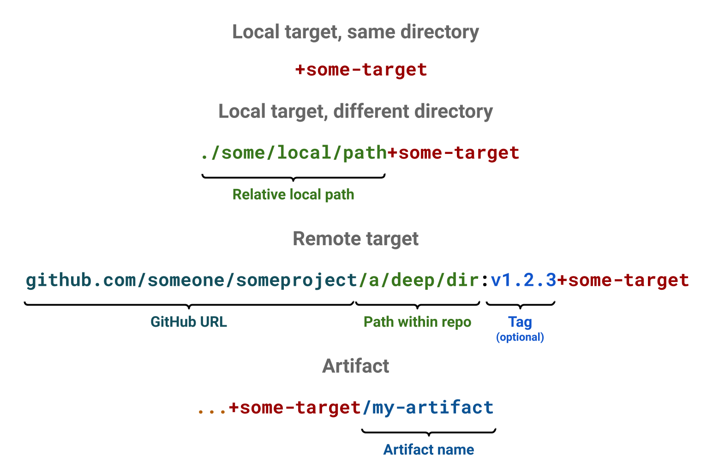

# Target, artifact and image referencing

This page describes the different types of references used in Earthly.



## Target reference

Targets have a particular referencing convention which helps Earthly to identify which recipe to execute.

### Local, internal

The simplest form, is where a target is referenced from the same directory:

`+<target-name>`

For example,

`+build`

In this form, Earthly will look for the target within the same dir (or within the same earthfile). We call this type of referencing local, internal. Local, because it comes from the same system, and internal, because it is within the same earthfile.

### Local, external

Another form, is where a target is referenced from a different directory. In this form, the path to that directory is specified before `+`. It must always start with either `./`, `../` or `/`, on any operating system (including Windows). Example:

`./path/to/another/dir+<target-name>`

For example:

`./js+build`

It is recommended that relative paths are used, for portability reasons: the working directory checked out by different users will be different, making absolute paths infeasible in most cases.


### Remote

Finally, the last form of target referencing is the remote form. In this form, the recipe and the build context are imported from a remote location. It has the following form:

`<vendor>/<namespace>/<project>/path/in/project[:some-tag]+<target-name>`

For example:

`github.com/earthly/earthly/buildkitd+buildkitd`

or

`github.com/earthly/earthly:v0.1.0+all`


### Implicit Base Target ###

All earthfiles start with a base recipe. This is the only recipe which does not have an explicit target name - the name is always implied to be `base`. All other target implicitly inherit from `base`. You can imagine that all recipes start with an implicit `FROM +base`

```
# base recipe
FROM golang:1.13-alpine3.11
WORKDIR /go-example

build:
    # implicit FROM +base
    RUN echo "Hello World"
```

### Canonical form

Most target references have a canonical form. It is essentially the remote form of the same target, with repository and tag inferred. The canonical form can be useful as a universal identifier for a target.

For example, depending on where the files are stored, the `+build` target could have the canonical form `github.com/some-user/some-project/some/deep/dir:master+build`, where `github.com/some-user/some-project` was inferred as the Git location, based on the Git remote called `origin`, and `/some/deep/dir` was inferred as the sub-directory where `+build` exists within that repository. The Earthly tag is inferred using the following algorithm:

* If the current HEAD has at least one Git tag, then use the first Git tag listed by Git, otherwise
* If the repository is not in detached HEAD mode, use the current branch, otherwise
* Use the current Git hash.

If no Git context is detected by Earthly, then the target does not have a canonical form.

## Artifact reference

Artifact references are similar to target references, except that they have an artifact path at the end. It has the following form

`<target-ref>/<artifact-path>`

Here are some examples:

* `+build/my-artifact`
* `+build/some/artifact/deep/in/a/dir`
* `./js+build/dist`
* `github.com/earthly/earthly:v0.1.0+earth/earth`

## Image reference

Because there can only be one image per target, image references have the exact same format as target references.

The only difference is the context where they are used. For example, a `FROM` command takes an image reference. While a `BUILD` command takes a target reference.
