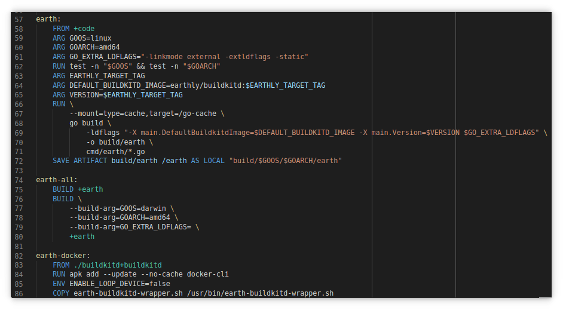

# Installation


## Pre-requisites (all platforms)

* [Docker](https://docs.docker.com/install/)
* [Git](https://git-scm.com/book/en/v2/Getting-Started-Installing-Git)

## Install earthly

### Linux

```bash
sudo /bin/sh -c 'wget https://github.com/earthly/earthly/releases/latest/download/earthly-linux-amd64 -O /usr/local/bin/earthly && chmod +x /usr/local/bin/earthly && /usr/local/bin/earthly bootstrap'
```

Alternatively, you may also download the linux binary from [the releases page](https://github.com/earthly/earthly/releases), rename it to `earthly` and place it in your `bin`.

### Mac

#### Homebrew

```bash
brew install earthly
```

#### Script

```bash
wget https://github.com/earthly/earthly/releases/latest/download/earthly-darwin-amd64 -O /usr/local/bin/earthly && chmod +x /usr/local/bin/earthly && /usr/local/bin/earthly bootstrap
```

Alternatively, you may also download the darwin binary from [the releases page](https://github.com/earthly/earthly/releases), rename it to `earthly` and place it in your `bin`.

### Windows via WSL (**beta**)

Earthly on Windows requires [Docker Desktop WSL2 backend](https://docs.docker.com/docker-for-windows/wsl/). Under `wsl`, run the following to install `earthly`.

```bash
sudo /bin/sh -c 'wget https://github.com/earthly/earthly/releases/latest/download/earthly-linux-amd64 -O /usr/local/bin/earthly && chmod +x /usr/local/bin/earthly && /usr/local/bin/earthly bootstrap'
```

### CI

For instructions on how to install `earthly` for CI use, see the [CI integration guide](../guides/ci-integration.md).

### Installing from source

To install from source, see the [contributing page](https://github.com/earthly/earthly/blob/main/CONTRIBUTING.md).

## Configuration

If you use SSH-based git authentication, then your git credentials will just work with Earthly. Read more about [git auth](../guides/auth).

For a full list of configuration options, see the [Configuration reference](../earthly-config/earthly-config.md)

## Verify installation

To verify that the installation works correctly, you can issue a simple build of an existing hello-world project

```bash
earthly github.com/earthly/hello-world:main+hello
```

You should see the output

```
github.com/earthly/hello-world:main+hello | --> RUN [echo 'Hello, world!']
github.com/earthly/hello-world:main+hello | Hello, world!
github.com/earthly/hello-world:main+hello | Target github.com/earthly/hello-world:main+hello built successfully
=========================== SUCCESS ===========================
```

## Syntax highlighting

### VS Code Extension

[](https://marketplace.visualstudio.com/items?itemName=earthly.earthfile-syntax-highlighting)

Add [Earthfile Syntax Highlighting](https://marketplace.visualstudio.com/items?itemName=earthly.earthfile-syntax-highlighting) to VS Code.

```
ext install earthly.earthfile-syntax-highlighting
```

### Vim Plugin

Visit [https://github.com/earthly/earthly.vim](https://github.com/earthly/earthly.vim) for details.

### Sublime Text Package

Add the [Earthly Earthfile package](https://packagecontrol.io/packages/Earthly%20Earthfile) via Package Control:

1. Press `Ctrl+Shift+P` (or `Cmd+Shift+P` on Mac) to bring up the Command Palette, and select **Install Package control** (if you haven't already installed Package Control).
2. Press `Ctrl+Shift+P` (or `Cmd+Shift+P` on Mac) again, select "Package Control: Install Package" and select **Earthly Earthfile** to install.
